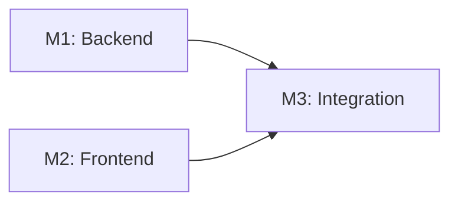

---
description:
  Execute the implementation planning workflow using the plan template to
  generate design artifacts.
---

## User Input

```text
$ARGUMENTS
```

You **MUST** consider the user input before proceeding (if not empty).

## Outline

1. **Setup**: Run `.specify/scripts/bash/setup-plan.sh --json` from repo root
   and parse JSON for FEATURE_SPEC, IMPL_PLAN, SPECS_DIR, BRANCH. For single
   quotes in args like "I'm Groot", use escape syntax: e.g 'I'\''m Groot' (or
   double-quote if possible: "I'm Groot").

2. **Load context**: Read FEATURE_SPEC and `.specify/memory/constitution.md`.
   Load IMPL_PLAN template (already copied).

3. **Execute plan workflow**: Follow the structure in IMPL_PLAN template to:

   - Fill Technical Context (mark unknowns as "NEEDS CLARIFICATION")
   - Fill Constitution Check section from constitution
   - **Fill Milestone Plan section** (MANDATORY per Constitution Principle IX):
     - Estimate feature effort (if >3 days, milestones REQUIRED)
     - Define milestones based on architectural layers and user stories
     - Mark parallel milestones with `[P]`
     - Define verification criteria for each milestone
     - Generate Mermaid dependency graph
   - Fill Testing Strategy section (MANDATORY - per Testing Roadmap)
   - Evaluate gates (ERROR if violations unjustified)
   - Phase 0: Generate research.md (resolve all NEEDS CLARIFICATION)
   - Phase 1: Generate data-model.md, contracts/, quickstart.md
   - Phase 1: Update agent context by running the agent script
   - Re-evaluate Constitution Check post-design

4. **Stop and report**: Command ends after Phase 2 planning. Report branch,
   IMPL_PLAN path, and generated artifacts.

## Phases

### Phase 0: Outline & Research

1. **Extract unknowns from Technical Context** above:

   - For each NEEDS CLARIFICATION → research task
   - For each dependency → best practices task
   - For each integration → patterns task

2. **Generate and dispatch research agents**:

   ```text
   For each unknown in Technical Context:
     Task: "Research {unknown} for {feature context}"
   For each technology choice:
     Task: "Find best practices for {tech} in {domain}"
   ```

3. **Consolidate findings** in `research.md` using format:
   - Decision: [what was chosen]
   - Rationale: [why chosen]
   - Alternatives considered: [what else evaluated]

**Output**: research.md with all NEEDS CLARIFICATION resolved

### Phase 1: Design & Contracts

**Prerequisites:** `research.md` complete

1. **Extract entities from feature spec** → `data-model.md`:

   - Entity name, fields, relationships
   - Validation rules from requirements
   - State transitions if applicable

2. **Generate API contracts** from functional requirements:

   - For each user action → endpoint
   - Use standard REST/GraphQL patterns
   - Output OpenAPI/GraphQL schema to `/contracts/`

3. **Agent context update**:
   - Run `.specify/scripts/bash/update-agent-context.sh cursor-agent`
   - These scripts detect which AI agent is in use
   - Update the appropriate agent-specific context file
   - Add only new technology from current plan
   - Preserve manual additions between markers

**Output**: data-model.md, /contracts/\*, quickstart.md, agent-specific file

### Milestone Plan (MANDATORY per Constitution Principle IX)

**Reference**: `.specify/memory/constitution.md` (Principle IX: Spec-Driven
Iteration)

For features requiring >3 days effort, the plan MUST include a complete
"Milestone Plan" section that:

1. **Estimates Feature Effort**: Calculate total implementation time

   - If <3 days: Milestone Plan optional (single PR acceptable)
   - If ≥3 days: Milestone Plan REQUIRED

2. **Defines Milestones**: Break feature into manageable PRs

   - Target: 15-25 tasks per milestone
   - Maximum: 30 tasks per milestone (larger = split)
   - Each milestone = 1 PR

3. **Maps User Stories to Milestones**: Connect spec.md stories to milestones

   - Each milestone should cover 1-3 user stories
   - Backend milestones: Backend portions of multiple stories
   - Frontend milestones: Frontend portions of multiple stories
   - Integration milestones: Connect all pieces

4. **Identifies Parallel Opportunities**: Mark `[P]` milestones

   - Milestones that can be developed simultaneously
   - Enables team parallelization
   - Reduces total delivery time

5. **Defines Verification Criteria**: What tests must pass per milestone
   - Unit tests for backend milestones
   - Jest tests for frontend milestones
   - E2E tests for integration milestones

**Milestone Plan Table Format**:

| ID     | Branch Suffix  | Scope                    | User Stories      | Verification    | Depends On |
| ------ | -------------- | ------------------------ | ----------------- | --------------- | ---------- |
| M1     | m1-backend     | Entities, DAOs, Services | P1, P2 (backend)  | Unit tests pass | -          |
| [P] M2 | m2-frontend    | React components         | P1, P2 (frontend) | Jest tests pass | -          |
| M3     | m3-integration | Controllers, API, E2E    | All               | E2E tests pass  | M1, M2     |

**Milestone Dependency Graph** (Mermaid):



### Testing Strategy (MANDATORY)

**Reference**: `.specify/guides/testing-roadmap.md`

The plan MUST include a complete "Testing Strategy" section that:

1. **References the Testing Roadmap**: Link to
   `.specify/guides/testing-roadmap.md`
2. **Documents Coverage Goals**: >80% backend, >70% frontend
3. **Identifies Test Types**: Unit, ORM validation, integration, E2E
4. **Describes Test Data Management**: Builders/factories, API-based setup
5. **Specifies Checkpoint Validations**: Which tests must pass at each phase

**Validation**: Ensure the testing strategy references the Testing Roadmap and
includes all required subsections (Coverage Goals, Test Types, Test Data
Management, Checkpoint Validations, TDD Workflow).

## Key rules

- Use absolute paths
- ERROR on gate failures or unresolved clarifications
- ERROR if Testing Strategy section is missing or incomplete
