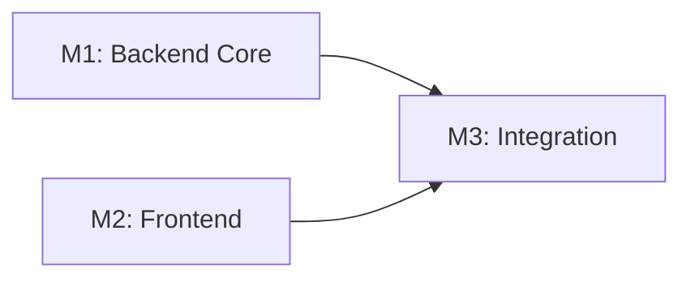

# Tasks: [FEATURE NAME]

**Feature Branch**: `feat/{issue-id}-{name}` **Input**: Design documents from
`/specs/[###-feature-name]/` **Prerequisites**: plan.md (required), spec.md
(required for user stories), research.md, data-model.md, contracts/

**Tests**: Tests are MANDATORY for all user stories (per Constitution V and
Testing Roadmap). Test tasks MUST appear BEFORE implementation tasks to enforce
TDD workflow.

**Organization**: Tasks are grouped by **Milestone** (per Constitution Principle
IX). Each Milestone = 1 PR. Milestones marked `[P]` can be developed in
parallel.

## Format: `[ID] [P?] [M#] Description`

- **[P]**: Can run in parallel (different files, no dependencies)
- **[M#]**: Which milestone this task belongs to (e.g., M1, M2, M3)
- Include exact file paths in descriptions

## Path Conventions

- **Single project**: `src/`, `tests/` at repository root
- **Web app**: `backend/src/`, `frontend/src/`
- **Mobile**: `api/src/`, `ios/src/` or `android/src/`
- Paths shown below assume single project - adjust based on plan.md structure

## Milestone Dependency Graph



**Legend**: Arrows show dependencies. Parallel milestones have no arrows between
them.

<!--
  ============================================================================
  IMPORTANT: The tasks below are SAMPLE TASKS for illustration purposes only.

  The /speckit.tasks command MUST replace these with actual tasks based on:
  - Milestones from plan.md (Milestone Plan section)
  - User stories from spec.md (with their priorities P1, P2, P3...)
  - Entities from data-model.md
  - Endpoints from contracts/

  Tasks MUST be organized by MILESTONE so each milestone can be:
  - Implemented as a single PR
  - Developed in parallel (if marked [P]) or sequentially
  - Verified independently before merge

  DO NOT keep these sample tasks in the generated tasks.md file.
  ============================================================================
-->

---

## Milestone 1: Backend Core (Branch: `feat/{issue}/m1-backend`)

**Type**: Sequential (blocks M3) **PR Target**: `feat/{issue-id}-{name}` or
`develop` **Scope**: Entities, DAOs, Services, Unit Tests **Verification**: All
unit tests pass, ORM validation tests pass **User Stories**: P1, P2 (backend
portions)

### Branch Setup (MANDATORY - First Task)

- [ ] T001 [M1] Create milestone branch:
      `git checkout -b feat/{issue}/m1-backend`

### Setup Tasks

- [ ] T002 [M1] Create project structure per implementation plan
- [ ] T003 [P] [M1] Configure linting and formatting tools
- [ ] T004 [M1] Setup database schema and migrations framework

### Tests for Milestone 1 (MANDATORY - TDD Enforcement)

> **CRITICAL: Write these tests FIRST, ensure they FAIL before implementation**
>
> Reference: [OpenELIS Testing Roadmap](.specify/guides/testing-roadmap.md)
> Templates: `.specify/templates/testing/`

- [ ] T005 [P] [M1] Unit test for [ServiceName] in
      src/test/java/org/openelisglobal/{module}/service/[ServiceName]Test.java
      (Template: `.specify/templates/testing/JUnit4ServiceTest.java.template`)
- [ ] T006 [P] [M1] ORM validation test in
      src/test/java/org/openelisglobal/{module}/HibernateMappingValidationTest.java
- [ ] T007 [P] [M1] DAO test for [DAO] in
      src/test/java/org/openelisglobal/{module}/dao/[DAO]Test.java

### Implementation for Milestone 1

> **CRITICAL: Implementation tasks depend on test tasks. Tests must pass before
> creating the milestone PR.**

- [ ] T008 [P] [M1] Create [Entity1] valueholder in
      src/main/java/org/openelisglobal/{module}/valueholder/
- [ ] T009 [P] [M1] Create [Entity2] valueholder in
      src/main/java/org/openelisglobal/{module}/valueholder/
- [ ] T010 [M1] Implement [DAO] in
      src/main/java/org/openelisglobal/{module}/dao/
- [ ] T011 [M1] Implement [Service] in
      src/main/java/org/openelisglobal/{module}/service/
- [ ] T012 [M1] Create Liquibase changesets in
      src/main/resources/liquibase/{module}/

### Milestone 1 Completion

- [ ] T013 [M1] Run all M1 tests: `mvn test -Dtest=*{module}*`
- [ ] T014 [M1] Create PR for M1: `feat/{issue}/m1-backend` → target branch

**Checkpoint**: Milestone 1 PR ready for review. All unit tests passing.

---

## [P] Milestone 2: Frontend (Branch: `feat/{issue}/m2-frontend`)

**Type**: Parallel (can be developed alongside M1) **PR Target**:
`feat/{issue-id}-{name}` or `develop` **Scope**: React Components, Jest Tests,
Internationalization **Verification**: Jest component tests pass, no hardcoded
strings **User Stories**: P1, P2 (frontend portions)

### Branch Setup (MANDATORY - First Task)

- [ ] T020 [M2] Create milestone branch:
      `git checkout -b feat/{issue}/m2-frontend`

### Tests for Milestone 2 (MANDATORY - TDD Enforcement)

> **CRITICAL: Write these tests FIRST, ensure they FAIL before implementation**

- [ ] T021 [P] [M2] Jest test for [ComponentName] in
      frontend/src/components/{feature}/[ComponentName].test.jsx
- [ ] T022 [P] [M2] Jest test for [ComponentName2] in
      frontend/src/components/{feature}/[ComponentName2].test.jsx

### Implementation for Milestone 2

- [ ] T023 [P] [M2] Create [Component1] in frontend/src/components/{feature}/
- [ ] T024 [P] [M2] Create [Component2] in frontend/src/components/{feature}/
- [ ] T025 [M2] Add internationalization strings to
      frontend/src/languages/\*.json
- [ ] T026 [M2] Add CSS/SCSS using Carbon tokens only

### Milestone 2 Completion

- [ ] T027 [M2] Run all M2 tests: `cd frontend && npm test`
- [ ] T028 [M2] Create PR for M2: `feat/{issue}/m2-frontend` → target branch

**Checkpoint**: Milestone 2 PR ready for review. All Jest tests passing.

---

## Milestone 3: Integration (Branch: `feat/{issue}/m3-integration`)

**Type**: Sequential (depends on M1, M2) **PR Target**: `feat/{issue-id}-{name}`
or `develop` **Scope**: Controllers, API Integration, E2E Tests
**Verification**: Integration tests pass, E2E tests pass **User Stories**: All
stories integrated

### Branch Setup (MANDATORY - First Task)

- [ ] T030 [M3] Create milestone branch:
      `git checkout -b feat/{issue}/m3-integration`
- [ ] T031 [M3] Merge M1 and M2 into M3 branch (if not already in target)

### Tests for Milestone 3 (MANDATORY - TDD Enforcement)

- [ ] T032 [P] [M3] Controller test for REST endpoint in
      src/test/java/org/openelisglobal/{module}/controller/
- [ ] T033 [P] [M3] Cypress E2E test in frontend/cypress/e2e/[feature].cy.js

### Implementation for Milestone 3

- [ ] T034 [M3] Implement [Controller] in
      src/main/java/org/openelisglobal/{module}/controller/
- [ ] T035 [M3] Connect frontend to backend API
- [ ] T036 [M3] Add error handling and validation

### Milestone 3 Completion

- [ ] T037 [M3] Run integration tests: `mvn verify`
- [ ] T038 [M3] Run E2E tests:
      `npm run cy:run -- --spec "cypress/e2e/[feature].cy.js"`
- [ ] T039 [M3] Create PR for M3: `feat/{issue}/m3-integration` → target branch

**Checkpoint**: Milestone 3 PR ready for review. All tests passing.

---

[Add more milestones as needed, following the same pattern]

---

## Final Milestone: Polish & Compliance (Branch: `feat/{issue}/m{N}-polish`)

**Type**: Sequential (depends on all prior milestones) **PR Target**:
`feat/{issue-id}-{name}` or `develop` **Scope**: Documentation, compliance
verification, final cleanup **Verification**: All constitution checks pass,
coverage goals met

### Branch Setup

- [ ] TXXX [M-Final] Create milestone branch:
      `git checkout -b feat/{issue}/m{N}-polish`

### Polish Tasks

- [ ] TXXX [P] [M-Final] Documentation updates in docs/
- [ ] TXXX [M-Final] Code cleanup and refactoring
- [ ] TXXX [P] [M-Final] Performance optimization
- [ ] TXXX [M-Final] Security hardening

### Constitution Compliance Verification (OpenELIS Global 3.0)

**Reference**: `.specify/memory/constitution.md`

- [ ] TXXX [M-Final] **Configuration-Driven**: Verify no country-specific code
      branches introduced
- [ ] TXXX [M-Final] **Carbon Design System**: Audit UI - confirm @carbon/react
      used exclusively
- [ ] TXXX [M-Final] **FHIR/IHE Compliance**: Validate FHIR resources (if
      applicable)
- [ ] TXXX [M-Final] **Layered Architecture**: Verify 5-layer pattern followed
- [ ] TXXX [M-Final] **Test Coverage**: Run coverage report - confirm >70% for
      new code
- [ ] TXXX [M-Final] **Schema Management**: Verify Liquibase changesets used
- [ ] TXXX [M-Final] **Internationalization**: Audit UI strings - confirm React
      Intl used
- [ ] TXXX [M-Final] **Security & Compliance**: Verify RBAC, audit trail, input
      validation
- [ ] TXXX [M-Final] **Milestone Scope**: Verify feature was properly broken
      into milestones (Principle IX)

### Final Milestone Completion

- [ ] TXXX [M-Final] Run full test suite: `mvn clean install`
- [ ] TXXX [M-Final] Run E2E tests:
      `npm run cy:run -- --spec "cypress/e2e/[feature].cy.js"`
- [ ] TXXX [M-Final] Create final PR: `feat/{issue}/m{N}-polish` → target branch

**Verification Commands**:

```bash
# Backend: Code formatting (MUST run before each commit) + build + tests
mvn spotless:apply && mvn spotless:check && mvn clean install

# Frontend: Formatting (MUST run before each commit) + E2E tests
cd frontend && npm run format
# Run E2E tests individually (per Constitution V.5):
npm run cy:run -- --spec "cypress/e2e/[feature].cy.js"
# Full suite only in CI/CD: npm run cy:run

# Coverage reports
mvn verify  # JaCoCo report in target/site/jacoco/
cd frontend && npm test -- --coverage  # Jest coverage
```

---

## Dependencies & Execution Order

### Milestone Dependencies

- **Milestone 1 (M1)**: Backend Core - No dependencies, starts immediately
- **[P] Milestone 2 (M2)**: Frontend - Can run in parallel with M1
- **Milestone 3 (M3)**: Integration - Depends on M1 AND M2 completion
- **Final Milestone**: Polish - Depends on all prior milestones

### PR Flow

```
develop
  ├── spec/{issue}-{name} (Spec PR #1)
  │
  └── feat/{issue}-{name} (Feature Integration Branch - optional)
        ├── feat/{issue}-{name}/m1-backend (Milestone PR #2)
        ├── feat/{issue}-{name}/m2-frontend (Milestone PR #3) [P - parallel]
        ├── feat/{issue}-{name}/m3-integration (Milestone PR #4)
        └── feat/{issue}-{name}/m{N}-polish (Milestone PR #5)
```

### Within Each Milestone

- Branch setup task MUST be first
- Tests MUST be written and FAIL before implementation
- Implementation tasks follow dependency order
- PR creation task is last
- All tests must pass before creating milestone PR

### Parallel Opportunities

**At Milestone Level**:

- Milestones marked `[P]` can be developed simultaneously
- Different developers can work on parallel milestones
- Sequential milestones must wait for dependencies

**At Task Level**:

- Tasks marked `[P]` within a milestone can run in parallel
- Entity/model tasks often parallelize well
- Test tasks often parallelize well

---

## Parallel Milestone Example

```bash
# Developer A works on M1 (Backend):
git checkout -b feat/OG-009-sidenav/m1-backend
# ... complete M1 tasks ...
# Create PR: m1-backend → feat/OG-009-sidenav

# Developer B works on M2 (Frontend) IN PARALLEL:
git checkout -b feat/OG-009-sidenav/m2-frontend
# ... complete M2 tasks ...
# Create PR: m2-frontend → feat/OG-009-sidenav

# After M1 and M2 PRs merged, Developer A or B works on M3:
git checkout feat/OG-009-sidenav
git pull  # Get merged M1 + M2
git checkout -b feat/OG-009-sidenav/m3-integration
# ... complete M3 tasks ...
```

---

## Implementation Strategy

### MVP First (Milestone 1 Only)

1. Complete Milestone 1: Backend Core
2. **STOP and VALIDATE**: Create M1 PR, get review
3. Merge M1 - backend is now usable/testable
4. Continue with subsequent milestones

### Incremental Delivery (Recommended)

1. Create Spec PR → Get alignment on approach
2. M1 PR → Backend reviewed and merged
3. M2 PR → Frontend reviewed and merged (can be parallel with M1)
4. M3 PR → Integration complete, E2E tests passing
5. Final PR → Polish and compliance verified
6. Each milestone adds value, each PR is reviewable

### Parallel Team Strategy

With multiple developers:

1. All developers review Spec PR together
2. Once Spec approved:
   - Developer A: Milestone 1 (Backend)
   - Developer B: Milestone 2 (Frontend) - IN PARALLEL
3. After M1 + M2 merged:
   - Any developer: Milestone 3 (Integration)
4. Faster delivery, smaller PRs, better reviews

---

## Notes

- `[P]` on milestones = can be developed in parallel with other `[P]` milestones
- `[P]` on tasks = can run in parallel within the same milestone
- `[M#]` label maps task to specific milestone for traceability
- Each milestone should be independently completable and reviewable
- Branch setup task is MANDATORY as first task of each milestone
- Verify tests fail before implementing
- Create PR after all milestone tasks complete
- Avoid: vague tasks, same file conflicts, cross-milestone dependencies that
  aren't declared
