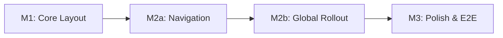

# Implementation Plan: Carbon Design System Sidenav

**Branch**: `009-carbon-sidenav` | **Created**: December 4, 2025 | **Last
Updated**: January 27, 2026 | **Spec**: [spec.md](spec.md) **Input**: Feature
specification from `/specs/009-carbon-sidenav/spec.md`

## Summary

Implement a tri-state sidenav (show/lock/close) by **enhancing the existing
Header.js** - NOT replacing it. The approach:

1. **Import salvageable hooks** (`useSideNavPreference`, `useMenuAutoExpand`)
   into existing Header.js
2. **Modernize React patterns** - Migrate from HOCs to hooks (`useIntl`,
   `useLocation` instead of `injectIntl`, `withRouter`)
3. **Remove `jsonpath` dependency** - Use `useMenuAutoExpand` for menu state
4. **Add lock mode** - When locked, Layout.js applies content margin class
5. **Keep all header actions in Header.js** - No extraction needed

This approach was chosen after the "TwoModeLayout replacement" approach caused
integration failures (infinite loops, missing navigation). The enhancement
approach preserves working code while adding new functionality.

## Technical Context

**Language/Version**: JavaScript (ES2020+), React 17  
**Primary Dependencies**: @carbon/react v1.15+, react-router-dom 5.2.0, React
Intl 5.20.12  
**Storage**: localStorage (browser) for preference persistence  
**Testing**: Jest + React Testing Library (unit), Playwright 1.57.0 (E2E)  
**Target Platform**: Modern browsers (Chrome, Firefox, Safari, Edge - desktop
primary)  
**Project Type**: Web application - Frontend only (no backend changes)  
**Performance Goals**: Smooth animation without user-perceived delay, reasonable
CI/CD execution time  
**Constraints**: Must not break existing navigation functionality, must support
4 levels of menu nesting, must preserve ALL header actions (notifications, user
menu, search, language, help, logout)  
**Scale/Scope**: Applied globally to all authenticated routes in a single
rollout (full Layout.js swap, header actions extracted and preserved)

## Constitution Check

_GATE: Must pass before Phase 0 research. Re-check after Phase 1 design._

Verify compliance with
[OpenELIS Global 3.0 Constitution](../../.specify/memory/constitution.md):

- [x] **Configuration-Driven**: No country-specific code branches - sidenav mode
      configurable via props
- [x] **Carbon Design System**: UI uses @carbon/react exclusively - Header,
      SideNav, SideNavItems, SideNavMenu, SideNavMenuItem, Content, Theme
      components
- [N/A] **FHIR/IHE Compliance**: No external data integration - frontend-only
  feature
- [N/A] **Layered Architecture**: Frontend-only feature - no backend changes
- [x] **Test Coverage**: Unit tests (Jest) + E2E tests (Playwright) planned
  - E2E tests MUST follow E2E best practices (Constitution V.5):
    - Playwright used for this feature (recommended for new tests per Testing
      Roadmap)
    - Run tests individually during development (not full suite)
    - Browser console logging enabled and reviewed after each run
    - Video recording disabled by default
    - Post-run review of console logs and screenshots required
    - Use semantic selectors (data-testid, ARIA roles)
    - Use setup project for login state (10-20x faster)
- [N/A] **Schema Management**: No database changes
- [x] **Internationalization**: All UI strings use React Intl - existing menu
      labels already internationalized
- [x] **Security & Compliance**: Uses existing menu API which filters by user
      permissions

**Complexity Justification Required If**:

- None identified - this feature aligns with all constitution principles

## Milestone Plan

_GATE: Features >3 days MUST define milestones per Constitution Principle IX.
Each milestone = 1 PR. Use `[P]` prefix for parallel milestones._

### Milestone Table

| ID  | Branch Suffix | Scope                                                       | User Stories           | Verification                     | Depends On |
| --- | ------------- | ----------------------------------------------------------- | ---------------------- | -------------------------------- | ---------- |
| M1  | m1-core       | useSideNavPreference hook, tri-state toggle, localStorage   | P1-US1, P1-US2         | Jest unit tests pass             | -          |
| M2a | m2a-nav       | useMenuAutoExpand hook, active styling                      | P2-US3                 | Jest tests pass                  | M1         |
| M2b | m2b-enhance   | Enhance Header.js with hooks, modernize patterns, lock mode | P2-US4, FR-011/012/013 | Integration tests pass, no loops | M1, M2a    |
| M3  | m3-polish     | Icons/tooltips, responsive behavior, E2E tests              | P3-US5, P3-US6         | E2E tests pass                   | M2b        |

**Legend**:

- **M1**: Core hooks (useSideNavPreference) - COMPLETE
- **M2a**: Navigation hook (useMenuAutoExpand) - COMPLETE
- **M2b**: Enhance Header.js (NOT replace) - integrate hooks, modernize patterns
- **M3**: Polish and E2E tests
- **Sequential**: M1 → M2a → M2b → M3 (each depends on previous)
- **Branch**: Full path is `feat/OGC-009-sidenav/{suffix}`

### Milestone Dependency Graph



### PR Strategy

- **Spec PR**: `spec/OGC-009-sidenav` → `develop` (this specification - already
  created)
- **M1 PR**: `feat/OGC-009-sidenav/m1-core` → `develop` ✅ COMPLETE
- **M2a PR**: `feat/OGC-009-sidenav/m2a-nav` → `develop` (navigation features)
- **M2b PR**: `feat/OGC-009-sidenav/m2b-rollout` → `develop` (global rollout +
  header preservation)
- **M3 PR**: `feat/OGC-009-sidenav/m3-polish` → `develop` (after M2b merged)

**Estimated Effort**: ~5-6 days total (justifies milestone breakdown per
Principle IX)

## Testing Strategy

**Reference**:
[OpenELIS Testing Roadmap](../../.specify/guides/testing-roadmap.md)

### Coverage Goals

- **Backend**: N/A - Frontend-only feature
- **Frontend**: >70% code coverage (measured via Jest)
- **Critical Paths**: 100% coverage (toggle functionality, preference
  persistence)

### Test Types

- [x] **Frontend Unit Tests**: React component logic (Jest + React Testing
      Library)
  - Template: `.specify/templates/testing/JestComponent.test.jsx.template`
  - **Reference**:
    [Testing Roadmap - Jest + React Testing Library](../../.specify/guides/testing-roadmap.md#jest--react-testing-library-unit-tests)
  - **Reference**:
    [Jest Best Practices](../../.specify/guides/jest-best-practices.md)
  - **Coverage Goal**: >70% (measured via Jest)
  - **TDD Workflow**: Red-Green-Refactor cycle for toggle logic and preference
    persistence
- [x] **E2E Tests**: Critical user workflows (Playwright - switched from
      Cypress)
  - Location: `frontend/playwright/tests/sidenav.spec.ts`
  - **Reference**:
    [Playwright Best Practices](../../.specify/guides/playwright-best-practices.md)
  - **Reference**:
    [Testing Roadmap - Playwright E2E Testing](../../.specify/guides/testing-roadmap.md#playwright-e2e-testing)
  - **Why Playwright**: Recommended for new tests per Constitution V.5 and
    Testing Roadmap. Benefits: Faster execution (10s vs 30s), better Page Object
    Model, modern async/await patterns, parallel CI workflow

### Test Data Management

- **Frontend**:
  - **E2E Tests (Playwright)**:
    - [x] Use setup project for login state (`auth.setup.ts` - authenticate
          once)
    - [x] Use Page Object Model (`Sidenav` fixture for reusable interactions)
    - [x] Use auto-retrying assertions (no arbitrary waits)
  - **Unit Tests (Jest)**:
    - [x] Mock menu data with hierarchical structure
    - [x] Mock localStorage for preference persistence testing
    - [x] Use `renderWithIntl()` helper for consistent component rendering

### Checkpoint Validations

- [x] **After Phase 4 (Frontend)**: Frontend unit tests (Jest) AND E2E tests
      (Playwright) must pass

### TDD Workflow

- [x] **TDD Mandatory**: Red-Green-Refactor cycle for toggle logic and
      localStorage persistence
- [x] **Test Tasks First**: Test tasks MUST appear before implementation tasks
      in tasks.md
- [x] **Checkpoint Enforcement**: Tests must pass before proceeding to next
      phase

## Project Structure

### Documentation (this feature)

```text
specs/009-carbon-sidenav/
├── plan.md              # This file
├── research.md          # Carbon SideNav patterns research
├── data-model.md        # Component state model
├── quickstart.md        # Developer setup guide
├── contracts/           # Component interface contracts
│   └── layout-props.md  # Layout component props interface
└── tasks.md             # Implementation tasks (created by /speckit.tasks)
```

### Source Code (repository root)

```text
frontend/
├── src/
│   ├── components/
│   │   └── layout/
│   │       ├── Layout.js              # MODIFY - Add content margin class for lock mode
│   │       ├── Header.js              # MODIFY - Add lock mode, hooks, auto-expand
│   │       ├── useSideNavPreference.js # KEEP - Custom hook for tri-state preference
│   │       ├── useSideNavPreference.test.js # KEEP - Unit tests for hook
│   │       ├── useMenuAutoExpand.js   # KEEP - Custom hook for menu auto-expansion
│   │       ├── useMenuAutoExpand.test.js # KEEP - Unit tests for hook
│   │       ├── Layout.integration.test.js # KEEP - Critical smoke tests
│   │       ├── TwoModeLayout.js       # ARCHIVE - Previous approach (reference only)
│   │       ├── TwoModeLayout.css      # ARCHIVE - Move useful styles to Style.css
│   │       └── index.js               # KEEP - Exports for layout components
│   └── pages/
│       └── [existing pages]
├── playwright/
│   └── tests/
│       └── sidenav.spec.ts           # E2E tests for sidenav
└── package.json
```

**Structure Decision**: Frontend-only feature that **enhances existing
components** rather than replacing them. The `useSideNavPreference` and
`useMenuAutoExpand` hooks from M1/M2a are integrated into the existing Header.js
and Layout.js.

## Complexity Tracking

> No constitution violations - table not applicable.

## Design Decisions

### D1: Direct State Control vs HeaderContainer

**Decision**: Use direct React state (`useState`) for sidenav state instead of
Carbon's `HeaderContainer` render prop pattern.

**Rationale**:

- `HeaderContainer` manages sidenav state internally, making it difficult to
  persist or control externally
- Direct state control enables localStorage persistence
- Enables page-level default configuration via props
- Reduces component complexity by removing render prop indirection

**Implementation**: See `AnalyzerLayout.js` lines 71-76 for reference pattern.

### D2: isFixedNav for Content Pushing

**Decision**: Use `isFixedNav={true}` + `isChildOfHeader={true}` on SideNav
component.

**Rationale**:

- `isPersistent={false}` (current Header.js) causes overlay behavior
- `isFixedNav={true}` makes sidenav push content, which is the expected desktop
  UX
- Content must be positioned as sibling to Header/SideNav, not nested within

**Implementation**: CSS classes `content-expanded` and `content-collapsed`
handle dynamic margins.

### D3: localStorage Key Strategy

**Decision**: Use layout-specific keys: `{layoutName}SideNavExpanded` (e.g.,
`analyzerSideNavExpanded`).

**Rationale**:

- Different layouts may have different default preferences
- Users can have separate preferences for analyzer vs other sections
- Global key would force same preference everywhere

### D4: Menu Auto-Expansion

**Decision**: Auto-expand parent menu items that contain the current route on
navigation.

**Rationale**:

- Users should see their location in the navigation hierarchy
- Prevents users from being "lost" in collapsed menus
- Implemented via recursive `markActiveExpanded()` function on route change

### D5: Enhance Header.js Instead of Replace (REVISED)

**Decision**: Enhance existing Header.js with lock mode and modern patterns. Do
NOT extract header actions into a separate component.

**Rationale** (Learned from Failed Approach):

- Extracting HeaderActions caused infinite re-render loops
- State sharing between header actions and sidenav broke when separated
- The working Header.js has ~300 lines of carefully integrated state management
- Preserving this integration is safer than recreating it

**Implementation**:

1. Import `useSideNavPreference` hook into Header.js for lock mode
2. Import `useMenuAutoExpand` hook for route-based menu expansion
3. Migrate from `withRouter`/`injectIntl` HOCs to `useLocation`/`useIntl` hooks
4. Remove `jsonpath` dependency - use immutable state updates
5. Layout.js imports `useSideNavPreference` to apply content margin class
6. Add lock button to HeaderGlobalBar (Pin/PinOutline icons)

**What Stays in Header.js**:

- Sidenav toggle and state
- User panel (profile, logout)
- Notifications panel (SlideOverNotifications)
- Search bar toggle
- Language selector
- Help menu
- All existing panel state management

## Risk Assessment

| Risk                         | Impact | Likelihood | Mitigation                                                 |
| ---------------------------- | ------ | ---------- | ---------------------------------------------------------- |
| Infinite loops from hooks    | High   | Low        | Integration tests check for "Maximum update depth" errors  |
| Breaking existing navigation | High   | Low        | Preserve menu API integration, test all menu item types    |
| HOC to hook migration issues | Medium | Medium     | Test each migration step, keep HOCs as fallback initially  |
| Mobile responsiveness issues | Medium | Medium     | Test on multiple viewport sizes, use Carbon breakpoints    |
| localStorage unavailable     | Low    | Low        | Graceful fallback to page default, log warning             |
| Performance degradation      | Medium | Low        | CSS transitions only (no JS animation), minimal re-renders |

**Lessons Learned from Failed Approach**:

- Extracting HeaderActions broke state sharing → Keep header actions in
  Header.js
- TwoModeLayout replacement caused integration failures → Enhance existing code
- Tests that mock too much miss real issues → Use integration smoke tests

## Dependencies

1. **@carbon/react v1.15+** - Already installed
2. **react-router-dom 5.2.0** - Already installed (for `useLocation`)
3. **React Intl 5.20.12** - Already installed (for internationalized menu
   labels)
4. **Existing menu API** - `/rest/menu` endpoint must continue working (no
   changes required)
