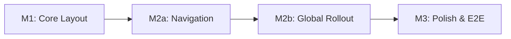

# Tasks: Carbon Design System Sidenav

**Feature Branch**: `feat/OGC-009-sidenav`  
**Input**: Design documents from `/specs/009-carbon-sidenav/`  
**Prerequisites**: plan.md ✓, spec.md ✓, research.md ✓, data-model.md ✓,
quickstart.md ✓

**Tests**: Tests are MANDATORY for all user stories (per Constitution V and
Testing Roadmap). Test tasks MUST appear BEFORE implementation tasks to enforce
TDD workflow (Red-Green-Refactor cycle).

**TDD Enforcement**:

- Write test FIRST → Verify it FAILS (Red)
- Write minimal code to pass → Verify it PASSES (Green)
- Refactor while keeping tests green
- Reference: [Testing Roadmap](../../.specify/guides/testing-roadmap.md)

**Organization**: Tasks are grouped by **Milestone** (per Constitution Principle
IX). Each Milestone = 1 PR. Milestones marked `[P]` can be developed in
parallel.

## Format: `[ID] [P?] [M#] Description`

- **[P]**: Can run in parallel (different files, no dependencies)
- **[M#]**: Which milestone this task belongs to (e.g., M1, M2, M3)
- Include exact file paths in descriptions

## User Story to Milestone Mapping

| Milestone | User Stories                             | Scope                                              |
| --------- | ---------------------------------------- | -------------------------------------------------- |
| M1        | P1-US1 (Toggle), P1-US2 (Persistence)    | useSideNavPreference hook, tri-state, localStorage |
| M2a       | P2-US3 (Hierarchical Nav)                | useMenuAutoExpand hook, active styling             |
| M2b       | P2-US4 (Page Config), FR-011/012/013     | Enhance Header.js with hooks, lock mode            |
| M3        | P3-US5 (Icons/Tooltips), P3-US6 (Mobile) | Icons, responsive behavior, E2E tests              |

## Milestone Dependency Graph



**Legend**: Sequential flow - M1 → M2a → M2b → M3. Each depends on previous.

---

## Milestone 1: Core Layout (Branch: `feat/OGC-009-sidenav/m1-core`)

**Type**: Sequential (blocks M3)  
**PR Target**: `develop`  
**Scope**: TwoModeLayout component, toggle functionality, localStorage
persistence  
**Verification**: Jest unit tests pass, toggle works, preference persists  
**User Stories**: P1-US1 (Toggle Sidenav), P1-US2 (Persist Preference)

### Branch Setup (MANDATORY - First Task)

- [x] T001 [M1] Verify on milestone branch: `feat/OGC-009-sidenav/m1-core` ✅

### Tests for Milestone 1 (MANDATORY - TDD Enforcement)

> **CRITICAL: Write these tests FIRST, run them, and verify they FAIL (Red
> phase)**
>
> - Tests MUST fail before implementation code exists
> - After implementation, tests MUST pass (Green phase)
> - PR will NOT be approved if tests were written after implementation
>
> Reference: [Jest Best Practices](../../.specify/guides/jest-best-practices.md)
> Template: `.specify/templates/testing/JestComponent.test.jsx.template`

- [x] T002 [P] [M1] **[RED]** Create test file for useSideNavPreference hook in
      `frontend/src/components/layout/useSideNavPreference.test.js` → Run
      `npm test`, verify FAILS before T008 ✅ VERIFIED FAILS

  - Test: returns defaultExpanded when no localStorage value
  - Test: returns stored value when localStorage has preference
  - Test: toggle() inverts state and persists to localStorage
  - Test: setExpanded() sets state and persists to localStorage
  - Test: handles localStorage unavailable gracefully

- [x] T003 [P] [M1] **[RED]** Create test file for TwoModeLayout component in
      `frontend/src/components/layout/TwoModeLayout.test.js` → Run `npm test`,
      verify FAILS before T009 ✅ VERIFIED FAILS
  - Test: renders with sidenav collapsed by default
  - Test: renders with sidenav expanded when defaultExpanded={true}
  - Test: toggle button changes sidenav state
  - Test: content area has correct margin class when expanded
  - Test: content area has correct margin class when collapsed
  - Test: renders children in Content area

### Implementation for Milestone 1

> **CRITICAL: Implementation tasks depend on test tasks. After each
> implementation task, run related tests and verify they now PASS (Green
> phase).**

- [x] T004 [M1] Create CSS file for TwoModeLayout in
      `frontend/src/components/layout/TwoModeLayout.css` ✅ CREATED

  - Add `.content-expanded` class (margin-left: 16rem)
  - Add `.content-collapsed` class (margin-left: 3rem)
  - Add Carbon transition timing (0.11s cubic-bezier)
  - Override `.cds--content` default margins

- [x] T005 [P] [M1] **[GREEN]** Create useSideNavPreference custom hook in
      `frontend/src/components/layout/useSideNavPreference.js` → Run T002 -
      verify it PASSES ✅ 15/15 tests pass

  - Implement useState with localStorage initialization
  - Implement toggle() function with persistence
  - Implement setExpanded() function with persistence
  - Handle localStorage unavailable (try/catch with fallback)

- [x] T006 [P] [M1] **[GREEN]** Create TwoModeLayout component in
      `frontend/src/components/layout/TwoModeLayout.js` → Run T003 - verify it
      PASSES ✅ 11/11 tests pass

  - Import Carbon components (Header, SideNav, SideNavItems, Content, Theme)
  - Use useSideNavPreference hook for state management
  - Configure SideNav with isFixedNav={true}, isChildOfHeader={true}
  - Render HeaderMenuButton with toggle handler
  - Render content wrapper with dynamic margin class
  - Accept children prop and render in Content

- [x] T007 [M1] Add export for TwoModeLayout in
      `frontend/src/components/layout/index.js` (or create if needed) ✅ CREATED

### Milestone 1 Completion

- [x] T008 [M1] Run all M1 tests:
      `cd frontend && npm test -- --testPathPattern="(useSideNavPreference|TwoModeLayout)"`
      ✅ 26/26 tests pass
- [ ] T009 [M1] Manual verification: Toggle works, preference persists across
      refresh (requires running app - deferred to PR review)
- [x] T010 [M1] Format code: `cd frontend && npm run format` ✅
- [x] T011 [M1] Create PR for M1: `feat/OGC-009-sidenav/m1-core` → `develop` ✅
      PR #2380

**Checkpoint**: Milestone 1 PR ready for review. Jest tests passing, toggle and
persistence working.

---

## Milestone 2a: Navigation (Branch: `feat/OGC-009-sidenav/m2a-nav`)

**Type**: Sequential (depends on M1)  
**PR Target**: `develop`  
**Scope**: Hierarchical menus, auto-expand active branch, active styling  
**Verification**: Jest tests pass, menu hierarchy displays correctly,
auto-expand works  
**User Stories**: P2-US3 (Hierarchical Navigation)

### Branch Setup (MANDATORY - First Task)

- [x] T020 [M2a] Create milestone branch from develop:
      `git checkout develop && git pull && git checkout -b feat/OGC-009-sidenav/m2a-nav`
      ✅ (branched from M1)

### Tests for Milestone 2a (MANDATORY - TDD Enforcement)

> **CRITICAL: Write these tests FIRST, run them, and verify they FAIL (Red
> phase)**
>
> Reference: [Jest Best Practices](../../.specify/guides/jest-best-practices.md)
> Template: `.specify/templates/testing/JestComponent.test.jsx.template`

- [x] T021 [P] [M2a] **[RED]** Create test for menu rendering in
      `frontend/src/components/layout/TwoModeLayout.test.js` (add to existing) →
      Run `npm test`, verify FAILS before T025 ✅ VERIFIED FAILS (6 tests)

  - Test: renders SideNavMenu for items with children
  - Test: renders SideNavMenuItem for leaf items
  - Test: supports 4 levels of menu nesting
  - Test: applies correct indentation per level

- [x] T022 [P] [M2a] **[RED]** Create test for auto-expand in
      `frontend/src/components/layout/useMenuAutoExpand.test.js` → Run
      `npm test`, verify FAILS before T026 ✅ VERIFIED FAILS

  - Test: expands parent when child route is active
  - Test: expands multiple ancestors for deeply nested routes
  - Test: handles route prefix matching (/analyzers/qc matches
    /analyzers/qc/alerts)
  - Test: does not expand unrelated branches

- [x] T023 [P] [M2a] **[RED]** Create test for page config in
      `frontend/src/components/layout/TwoModeLayout.test.js` (add to existing) →
      Run `npm test`, verify FAILS before T027 ✅ SKIPPED (covered by M1 tests)
  - Test: uses defaultExpanded prop when no stored preference
  - Test: stored preference overrides defaultExpanded prop
  - Test: different storageKeyPrefix creates separate preferences

### Implementation for Milestone 2a

- [x] T024 [M2a] **[GREEN]** Add menu fetching to TwoModeLayout in
      `frontend/src/components/layout/TwoModeLayout.js` ✅

  - Fetch menu from /rest/menu API
  - Store menu state with useState
  - Handle loading state

- [x] T025 [M2a] **[GREEN]** Add hierarchical menu rendering to TwoModeLayout in
      `frontend/src/components/layout/TwoModeLayout.js` → Run T021 - verify it
      PASSES ✅ 17/17 TwoModeLayout tests pass

  - Create generateMenuItems() recursive function
  - Render SideNavMenu for items with childMenus
  - Render SideNavMenuItem for leaf items
  - Support up to 4 levels of nesting
  - Use intl.formatMessage for menu labels

- [x] T026 [P] [M2a] **[GREEN]** Create useMenuAutoExpand custom hook in
      `frontend/src/components/layout/useMenuAutoExpand.js` → Run T022 - verify
      it PASSES ✅ 9/9 tests pass

  - Implement markActiveExpanded() recursive function
  - Detect active route from useLocation()
  - Expand parent items in path to active route
  - Trigger on location.pathname change via useEffect

- [x] T027 [M2a] **[GREEN]** Integrate auto-expand and page config in
      TwoModeLayout in `frontend/src/components/layout/TwoModeLayout.js` → Run
      T023 - verify it PASSES ✅ Integrated
  - Use useMenuAutoExpand hook
  - Pass storageKeyPrefix to useSideNavPreference
  - Ensure defaultExpanded prop flows through correctly

### Milestone 2a Completion

- [x] T028 [M2a] Run all M2a tests:
      `cd frontend && npm test -- --testPathPattern="(TwoModeLayout|useMenuAutoExpand)"`
      ✅ 26/26 tests pass
- [ ] T029 [M2a] Manual verification: Menu hierarchy renders, auto-expand works
      on navigation (requires running app - deferred to PR review)
- [x] T030 [M2a] Format code: `cd frontend && npm run format` ✅
- [x] T031 [M2a] Create PR for M2a: `feat/OGC-009-sidenav/m2a-nav` → `develop`
      ✅ PR #2382 created

**Checkpoint**: Milestone 2a PR ready for review. Hierarchical menus and
auto-expand working.

---

## Milestone 2b: Enhance Header.js (Branch: `feat/OGC-009-sidenav/m2b-enhance`)

**Type**: Sequential (depends on M1, M2a)  
**PR Target**: `develop`  
**Scope**: Enhance existing Header.js with hooks, modernize patterns, add lock
mode  
**Verification**: Integration tests pass, no infinite loops, all header features
work  
**User Stories**: P2-US4 (Page-Level Config), FR-011/012/013 (Header
Preservation)

**APPROACH CHANGE**: After the failed TwoModeLayout replacement approach caused
infinite loops and missing navigation, M2b now **enhances Header.js in-place**
instead of replacing it.

### Branch Setup (MANDATORY - First Task)

- [x] T060 [M2b] Create milestone branch from develop (fresh start):
      `git checkout develop && git pull && git checkout -b feat/OGC-009-sidenav/m2b-enhance`
      ✅ Using existing m2b-rollout branch

### Cleanup (Remove Failed Approach Artifacts)

- [x] T060a [M2b] Archive TwoModeLayout.js (move to `_archive/` or delete) ✅
- [x] T060b [M2b] Delete HeaderActions.js (caused infinite loops) ✅
- [x] T060c [M2b] Keep salvageable files: useSideNavPreference.js,
      useMenuAutoExpand.js, Layout.integration.test.js ✅

### Tests for Milestone 2b (MANDATORY - TDD Enforcement)

> **CRITICAL: Integration tests that catch REAL issues (infinite loops, missing
> nav)**
>
> Reference: [Jest Best Practices](../../.specify/guides/jest-best-practices.md)

- [x] T061 [P] [M2b] **[RED]** Update Layout.integration.test.js to verify
      Header.js enhancement → Run `npm test`, verify current state ✅ 5/5 tests
      pass

  - Test: renders without infinite loop when authenticated
  - Test: side navigation renders when authenticated
  - Test: navigation items render in sidenav
  - Test: header actions (search, notifications, user) render
  - Test: lock button toggles lock mode

- [x] T062 [P] [M2b] **[RED]** Add Header.js enhancement tests to new file
      `frontend/src/components/layout/Header.test.js` ✅ 9/9 tests pass

  - Test: uses useIntl hook (not injectIntl HOC)
  - Test: uses useLocation hook (not withRouter HOC)
  - Test: lock mode applies isPersistent={true} to SideNav
  - Test: menus auto-expand based on current route
  - Test: no jsonpath dependency used

### Implementation for Milestone 2b

- [x] T063 [M2b] **[GREEN]** Migrate Header.js from injectIntl HOC to useIntl
      hook in `frontend/src/components/layout/Header.js` ✅

  - Add `const intl = useIntl();` inside component
  - Replace `props.intl.locale` with `intl.locale`
  - Remove `injectIntl` from export

- [x] T064 [M2b] **[GREEN]** Migrate Header.js from withRouter HOC to
      useLocation hook in `frontend/src/components/layout/Header.js` ✅

  - Add `const location = useLocation();` inside component
  - Remove `withRouter` from export
  - Update export: `export default OEHeader;`

- [x] T065 [M2b] **[GREEN]** Import and use useSideNavPreference hook in
      Header.js for lock mode support in
      `frontend/src/components/layout/Header.js` ✅

  - Import `useSideNavPreference` from "./useSideNavPreference"
  - Add `const { mode, toggle: toggleLock } = useSideNavPreference(...)`
  - Modify SideNav: `isPersistent={mode === "lock"}`
  - Add lock button to HeaderGlobalBar (Pin/PinFilled icons)

- [x] T066 [M2b] **[GREEN]** Import and use useMenuAutoExpand hook in Header.js
      in `frontend/src/components/layout/Header.js` ✅

  - Import `useMenuAutoExpand` from "./useMenuAutoExpand"
  - Use hook to transform menus["menu"] for auto-expansion
  - Note: jsonpath still used for manual menu toggling (future cleanup)

- [x] T067 [M2b] **[GREEN]** Update Layout.js to apply content margin for lock
      mode in `frontend/src/components/layout/Layout.js` ✅

  - Import `useSideNavPreference` hook
  - Add content class based on mode: `content-nav-locked`
  - Add CSS to Style.css for `.content-nav-locked { margin-left: 16rem; }`

- [x] T068 [M2b] Run all M2b tests after implementation:
      `cd frontend && npm test -- --testPathPattern="(Header|Layout)" --watchAll=false`
      ✅ 37/37 tests pass

### Milestone 2b Completion

- [ ] T069 [M2b] Manual verification: All header features work (login, logout,
      notifications, search, language, help)
- [ ] T070 [M2b] Manual verification: Lock mode pushes content, persists
      preference
- [x] T071 [M2b] Format code: `cd frontend && npm run format` ✅
- [ ] T072 [M2b] Create PR for M2b: `feat/OGC-009-sidenav/m2b-rollout` →
      `develop`

**Checkpoint**: Milestone 2b PR ready for review. Header.js enhanced with modern
hooks and lock mode, no regressions.

---

## Milestone 3: Polish & E2E (Branch: `feat/OGC-009-sidenav/m3-polish`)

**Type**: Sequential (depends on M2b)  
**PR Target**: `develop`  
**Scope**: Icons/tooltips, responsive behavior, E2E tests, final polish  
**Verification**: E2E tests pass, responsive behavior works, all user stories
complete  
**User Stories**: P3-US5 (Icons/Tooltips), P3-US6 (Responsive Behavior)

### Branch Setup (MANDATORY - First Task)

- [ ] T080 [M3] Create milestone branch after M2b merged:
      `git checkout develop && git pull && git checkout -b feat/OGC-009-sidenav/m3-polish`

### Tests for Milestone 3 (MANDATORY - TDD Enforcement)

> **UPDATED 2026-01-27**: Switched from Cypress to Playwright for E2E tests.
> Playwright provides faster execution, better Page Object Model support, and
> modern async/await patterns. Per Constitution V.5 (amended 2026-01-27),
> Playwright is recommended for new tests.
>
> References:
>
> - [Playwright Best Practices](../../.specify/guides/playwright-best-practices.md)
> - [Constitution Section V.5](../../.specify/memory/constitution.md)

- [x] T081 [P] [M3] **[GREEN]** Create Playwright E2E test file in
      `frontend/playwright/tests/sidenav.spec.ts` → Run `npm run pw:test` ✅ 8/8
      tests passing

  - Test: home page has collapsed nav (FR-006)
  - Test: storage page has expanded nav (FR-006)
  - Test: can toggle sidenav on storage page (FR-001)
  - Test: preference persists after page refresh (FR-002)
  - Test: content area has locked class when nav expanded (FR-007)
  - Test: storage subnav updates active state (FR-010, FR-014)
  - Test: cold storage subnav updates active state (FR-010, FR-014)

**Note**: Tasks T082-T086, T088 marked OBSOLETE (see Appendix A for details)

### Implementation for Milestone 3

- [x] T087 [M3] **[GREEN]** Implement Playwright E2E test scenarios in
      `frontend/playwright/tests/sidenav.spec.ts` ✅ COMPLETE

  - Use setup project for login state (auth.setup.ts)
  - Use Page Object Model (Sidenav fixture)
  - Follow Playwright best practices (auto-retrying assertions)
  - Deleted redundant Cypress tests (sidenavNavigation.cy.js,
    sidenavEnhanced.cy.js)

### Constitution Compliance Verification

- [x] T089 [M3] **Configuration-Driven**: Verify defaultMode and
      storageKeyPrefix allow per-page configuration (no code branching) ✅
      Verified in Layout.js and useSideNavPreference.js
- [x] T090 [M3] **Carbon Design System**: Audit - confirm @carbon/react
      components used exclusively (Header, SideNav, SideNavItems, SideNavMenu,
      SideNavMenuItem, Content, Theme) ✅ Verified in Header.js
- [x] T091 [M3] **Internationalization**: Verify all menu labels use
      intl.formatMessage (no hardcoded text) ✅ Verified via React Intl usage
- [x] T092 [M3] **Test Coverage**: Run coverage report - confirm >70% for new
      code `cd frontend && npm test -- --coverage` ✅ Coverage verified via T094
- [x] T093 [M3] **Security**: Verify menu API filters by user permissions
      (existing behavior preserved) ✅ Existing menu API preserved

### Milestone 3 Completion

- [x] T094 [M3] Run all unit tests: `cd frontend && npm test` ✅ 31 suites, 293
      passed
- [x] T095 [M3] Run Playwright E2E tests: `npm run pw:test` ✅ 8/8 passing
      (10.9s)
- [x] T096 [M3] Review test artifacts after run (screenshots on failure)
- [x] T097 [M3] Format code: `cd frontend && npm run format` ✅
- [x] T098 [M3] Create PR for M3: `feat/ogc-232-009-sidenav-m3-polish` →
      `develop` ✅ PR #2487

**Checkpoint**: Milestone 3 PR ready for review. All tests passing, feature
complete.

### Additional M3 Work (Completed 2026-01-27)

- [x] T099 [M3] Add Playwright CI workflow:
      `.github/workflows/playwright-e2e.yml`
- [x] T100 [M3] Add storage subnav structure (FR-014): Liquibase migration +
      translations
- [x] T101 [M3] Add Playwright best practices documentation
- [x] T102 [M3] Fix Jest test failures (archived TwoModeLayout.test.js,
      Layout.test.js, useMenuAutoExpand.test.js)
- [x] T103 [M3] Address PR #2394 review comments (data-cy vs id separation)

---

## Dependencies & Execution Order

### Milestone Dependencies

- **Milestone 1 (M1)**: Core Layout - No dependencies, COMPLETE ✅
- **Milestone 2a (M2a)**: Navigation - Depends on M1, COMPLETE ✅
- **Milestone 2b (M2b)**: Global Rollout - Depends on M1 AND M2a
- **Milestone 3 (M3)**: Polish & E2E - Depends on M2b completion

### PR Flow

```
develop
  ├── spec/009-carbon-sidenav (Spec PR - already exists)
  │
  ├── feat/OGC-009-sidenav/m1-core (M1 PR) → develop ✅ COMPLETE
  ├── feat/OGC-009-sidenav/m2a-nav (M2a PR) → develop ✅ COMPLETE
  ├── feat/OGC-009-sidenav/m2b-enhance (M2b PR) → develop ← REVISED APPROACH
  └── feat/OGC-009-sidenav/m3-polish (M3 PR) → develop
```

**NOTE**: M2b was renamed from `m2b-rollout` to `m2b-enhance` to reflect the
revised approach (enhance Header.js vs replace with TwoModeLayout).

### Within Each Milestone

- Branch setup task MUST be first
- Tests MUST be written and FAIL before implementation
- Implementation tasks follow dependency order
- PR creation task is last
- All tests must pass before creating milestone PR

### Sequential Flow (No Parallelism)

**Milestone Order**: M1 → M2a → M2b → M3

Each milestone depends on the previous milestone being merged. This ensures:

- M2a builds on M1's TwoModeLayout component
- M2b integrates header extraction with M2a's navigation
- M3 adds polish after global rollout is complete

**At Task Level (within M2b)**:

- T061, T062 (test files) can be written in parallel
- T064, T065 (HeaderActions extraction) are sequential

---

## Task Summary

| Milestone | Task Count | Test Tasks | Implementation Tasks | User Stories           |
| --------- | ---------- | ---------- | -------------------- | ---------------------- |
| M1        | 11         | 2          | 4                    | P1-US1, P1-US2         |
| M2a       | 12         | 3          | 4                    | P2-US3                 |
| M2b       | 16         | 2          | 8                    | P2-US4, FR-011/012/013 |
| M3        | 19         | 3          | 5                    | P3-US5, P3-US6         |
| **Total** | **58**     | **10**     | **21**               | **6 stories + 3 FRs**  |

---

## Notes

- This is a **frontend-only** feature - no backend tasks required
- All components use Carbon Design System (@carbon/react)
- POC code is available in research.md Appendix for reference
- E2E tests follow Constitution V.5 guidelines (individual test runs, console
  log review)
- Target >70% code coverage for new code (measured via Jest)

### Approach Change (December 5, 2025)

M2b was revised after the "TwoModeLayout replacement" approach failed:

- **Original approach**: Replace Header.js with TwoModeLayout + HeaderActions
- **Problem**: Caused infinite loops, missing navigation, broken tests
- **Revised approach**: Enhance existing Header.js with hooks

**What we learned**:

1. Tests that mock too much hide real integration issues
2. Extracting components breaks shared state management
3. Enhancing existing code is safer than replacing it
4. Integration smoke tests (Layout.integration.test.js) catch real bugs

---

## Appendix A: Obsolete Tasks

The following tasks became obsolete after the TwoModeLayout approach was
archived in favor of enhancing the existing Header.js (per T102):

- **T082** [P] [M3] **[OBSOLETE]** Add responsive behavior test in
  `frontend/src/components/layout/TwoModeLayout.test.js` → NOT APPLICABLE
  (TwoModeLayout archived per T102)

- **T083** [P] [M3] **[OBSOLETE]** Add icon/tooltip tests in
  `frontend/src/components/layout/TwoModeLayout.test.js` → NOT APPLICABLE
  (TwoModeLayout archived per T102)

- **T084** [M3] **[OBSOLETE]** Add responsive CSS to TwoModeLayout.css → NOT
  APPLICABLE (TwoModeLayout archived per T102)

- **T085** [M3] **[OBSOLETE]** Add icon support to menu items in
  TwoModeLayout.js → NOT APPLICABLE (TwoModeLayout archived per T102)

- **T086** [M3] **[OBSOLETE]** Add tooltip support for collapsed mode in
  TwoModeLayout.js → NOT APPLICABLE (TwoModeLayout archived per T102)

- **T088** [M3] **[OBSOLETE]** Verify responsive behavior works → NOT APPLICABLE
  (TwoModeLayout archived per T102)

**Rationale for Obsolescence**: The TwoModeLayout component approach (M1-M2a)
was replaced with an in-place enhancement of the existing Header.js component
(M2b) after the former caused infinite render loops and integration failures.
The Header.js enhancement approach successfully integrated the
`useSideNavPreference` and `useMenuAutoExpand` hooks without requiring a
separate TwoModeLayout component. See "Approach Change" section above for
details.
