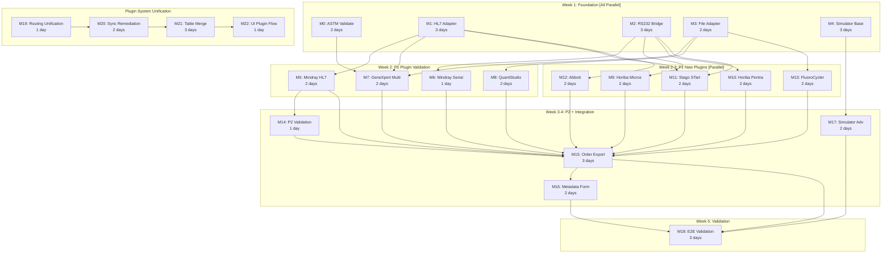

# Implementation Plan: Madagascar Analyzer Integration

**Branch**: `feat/011-madagascar-analyzer-integration` | **Date**: 2026-01-22 |
**Updated**: 2026-01-27 (clarification session updates) **Spec**:
[spec.md](spec.md) **Contract Deadline**: 2026-02-28 (32 days from plan update)

## Summary

This plan extends the existing Feature 004 ASTM analyzer mapping infrastructure
to support the Madagascar contract requirements: integrating 12+ laboratory
analyzers with bidirectional communication. The implementation leverages:

1. **Existing 004 infrastructure**: Field mapping engine, error dashboard,
   status management, TCP/IP connectivity via ASTM-HTTP Bridge
2. **19+ existing analyzer plugins**: Mindray, SysmexXN-L, GeneXpertHL7,
   GeneXpertFile, QuantStudio3
3. **External plugin JAR approach**: All analyzer plugins are external JARs in
   `plugins/analyzers/` per `docs/analyzer.md`. New plugins (M9-M13) are built
   in the plugins submodule, NOT in `src/main/java/`.
4. **Bridge-based RS232**: Extend ASTM-HTTP Bridge to handle RS232→TCP locally

**Key Technical Additions**:

- HL7 v2.x protocol support (ORU^R01 results, ORM^O01 orders)
- RS232 serial communication via extended ASTM-HTTP Bridge
- File-based result import (directory watcher, CSV/TXT parsing)
- Order export workflow (manual trigger, status tracking)
- Enhanced instrument metadata form
- Multi-protocol analyzer simulator (expanding analyzer-mock-server)

## Clarification Session Updates (2026-01-27)

Key decisions from `/speckit.clarify` session:

| Decision                      | Impact                                                                        |
| ----------------------------- | ----------------------------------------------------------------------------- |
| **Priority by Romain's List** | Analyzers reordered: P1 (high), P1-M (moderate), P2 (not on list)             |
| **P3 Stretch Goals**          | 10 additional analyzers as stretch goals if time permits                      |
| **Multi-Protocol Adapters**   | Adapters support multiple protocols per analyzer for deployment flexibility   |
| **Simulator-Only Validation** | Physical testing happens post-deployment; simulator sufficient for go-live    |
| **RS232 via Bridge**          | ASTM-HTTP Bridge extended to handle RS232→TCP locally (no Docker passthrough) |

## Technical Context

**Language/Version**: Java 21 LTS (OpenJDK/Temurin), Jakarta EE 9 **Primary
Dependencies**: Spring Framework 6.2.2 (Traditional MVC), Hibernate 6.x, HAPI
HL7 v2 library, jSerialComm 2.x (bridge only), Apache Commons CSV **Storage**:
PostgreSQL 14+ via Liquibase migrations **Testing**: JUnit 4 + Mockito
(backend), Jest + React Testing Library (frontend), Cypress 12.x (E2E) **Target
Platform**: Docker containers on Ubuntu 20.04+, RS232 via bridge on lab PC
**Project Type**: Web application (Java backend + React frontend) **Performance
Goals**: 60-second message processing, 5+ concurrent analyzers, 99%+ uptime
**Constraints**: Contract deadline 2026-02-28, backward compatibility with
Feature 004, legacy XML-mapped Analyzer entity

## Constitution Check

_GATE: Must pass before Phase 0 research. Re-check after Phase 1 design._

Verify compliance with
[OpenELIS Global Constitution](../../.specify/memory/constitution.md):

- [x] **Configuration-Driven**: No Madagascar-specific code branches; all
      analyzer configs via database (CR-006)
- [x] **Carbon Design System**: UI extends existing 004 Carbon components; NO
      Bootstrap/Tailwind (CR-001)
- [x] **FHIR/IHE Compliance**: Optional FHIR R4 for device/location sync; not
      required for core functionality (CR-005)
- [x] **Layered Architecture**: Backend follows 5-layer pattern; new entities
      use JPA annotations (CR-003)
  - **Valueholders MUST use JPA/Hibernate annotations** - InstrumentMetadata,
    OrderExport, SerialPortConfiguration, FileImportConfiguration
  - **Legacy exception**: Analyzer entity remains XML-mapped; manual
    relationship management pattern from 004
  - **Transaction management MUST be in service layer only** - NO @Transactional
    on controllers
  - **Services compile all data within transaction** - Prevent
    LazyInitializationException
- [x] **Test Coverage**: Unit + ORM validation + integration + E2E planned; >80%
      backend, >70% frontend (CR-008)
  - E2E tests follow Cypress best practices (Constitution V.5)
  - Run tests individually during development
  - **Simulator-only validation** sufficient for go-live (per clarification)
- [x] **Schema Management**: Database changes via Liquibase changesets (CR-004)
- [x] **Internationalization**: All UI strings via React Intl; en + fr required
      (CR-002)
- [x] **Security & Compliance**: RBAC for analyzer config (LAB_SUPERVISOR+),
      audit trail, input validation (CR-007)

**Complexity Justification Required If**: None anticipated - all work follows
established patterns.

## Parallel Workstreams

Per user request, the plan identifies **5 parallel workstreams** to maximize
development velocity while respecting dependencies:

```
┌─────────────────────────────────────────────────────────────────────────────┐
│                         PARALLEL WORKSTREAMS                                 │
├─────────────────────────────────────────────────────────────────────────────┤
│                                                                             │
│  Workstream A: ASTM-over-TCP Finalization (PRIORITY - existing infra)       │
│  ────────────────────────────────────────────────────────────────────────   │
│  M0 → Stabilize existing ASTM bridge + GeneXpert validation                 │
│                                                                             │
│  Workstream B: HL7 Adapter + Plugins                                        │
│  ────────────────────────────────────────────────────────────────────────   │
│  M1 → M5 → M6 → M12 (HL7 adapter, then Mindray/Sysmex/Abbott)              │
│                                                                             │
│  Workstream C: RS232 via Bridge + Plugins                                   │
│  ────────────────────────────────────────────────────────────────────────   │
│  M2 → M9 → M10 → M11 (Serial bridge, then Horiba/Stago)                    │
│                                                                             │
│  Workstream D: File Adapter + Plugins                                       │
│  ────────────────────────────────────────────────────────────────────────   │
│  M3 → M7 → M8 → M13 (File adapter, then GeneXpert-File/QS7/Hain)           │
│                                                                             │
│  Workstream E: Simulator Development                                        │
│  ────────────────────────────────────────────────────────────────────────   │
│  M4 → M17 (Multi-protocol simulator base → Advanced features)               │
│                                                                             │
└─────────────────────────────────────────────────────────────────────────────┘
```

## Milestone Plan

_GATE: Features >3 days MUST define milestones per Constitution Principle IX.
Each milestone = 1 PR. Use `[P]` prefix for parallel milestones._

### Milestone Strategy: ASTM First, Then Parallel Adapters

Per user request:

1. **Finalize ASTM-over-TCP workstream first** (existing infrastructure)
2. **Build adapters in parallel** (HL7, RS232-via-bridge, File)
3. **Validate plugins by Romain's priority order** (P1 first, then P1-M, then
   P2)
4. **Manageable milestone size** (2-4 days each)

### Priority-Ordered Analyzer List (from Clarification Session)

| Priority | Analyzer             | Protocol      | Existing Plugin | Workstream |
| -------- | -------------------- | ------------- | --------------- | ---------- |
| **P1**   | Cepheid GeneXpert    | ASTM/HL7/File | ✅ 3 variants   | A, B, D    |
| **P1**   | Horiba Micros 60     | RS232/ASTM    | ❌ Build new    | C          |
| **P1**   | QuantStudio 7 Flex   | File          | ⚠️ Adapt QS3    | D          |
| **P1**   | Mindray BC-5380      | HL7           | ✅ Mindray      | B          |
| **P1**   | Mindray BA-88A       | RS232/ASTM    | ✅ Mindray      | C          |
| **P1**   | Horiba Pentra 60     | RS232/ASTM    | ❌ Build new    | C          |
| **P1**   | Abbott Architect     | HL7/RS232     | ❌ Build new    | B, C       |
| **P1**   | Hain FluoroCycler XT | File          | ❌ Build new    | D          |
| **P1**   | Mindray BS-360E      | HL7           | ✅ Mindray      | B          |
| **P1-M** | Stago STart 4        | ASTM/HL7      | ❌ Build new    | B, C       |
| **P2**   | Mindray BC2000       | HL7           | ✅ Mindray      | B          |
| **P2**   | Sysmex XN Series     | HL7           | ✅ SysmexXN-L   | B          |

### Milestone Table

| ID          | Branch Suffix           | Scope                                                            | Workstream | Status      | PR #  | User Stories | Verification                                     | Depends On    | Est. Days |
| ----------- | ----------------------- | ---------------------------------------------------------------- | ---------- | ----------- | ----- | ------------ | ------------------------------------------------ | ------------- | --------- |
| **[P] M0**  | m0-astm-stabilize       | Validate ASTM mock setup, integration tests                      | A          | ⚠️ PENDING  | -     | US-6         | Mock→OpenELIS flow works end-to-end              | -             | 2         |
| **[P] M1**  | m1-hl7-adapter          | HL7 v2.x protocol adapter (parser + generator)                   | B          | ✅ COMPLETE | #2602 | US-1         | Unit tests: ORU^R01/ORM^O01; HL7 round-trip      | -             | 3         |
| **[P] M2**  | m2-serial-bridge        | RS232 support in ASTM-HTTP Bridge (RS232→TCP)                    | C          | ✅ COMPLETE | #2600 | US-3         | Bridge handles RS232; virtual serial tests       | -             | 3         |
| **[P] M3**  | m3-file-adapter         | File-based import adapter (directory watcher)                    | D          | ✅ COMPLETE | #2599 | US-4         | File detection, CSV parsing, archival            | -             | 2         |
| **[P] M4**  | m4-simulator-base       | Multi-protocol simulator (HL7, RS232, File)                      | E          | ✅ COMPLETE | #2601 | US-9         | Simulator supports all protocols; 80%+ templates | -             | 3         |
| **M5**      | m5-mindray-hl7          | Mindray plugin validation (BC-5380, BS-360E)                     | B          | ✅ COMPLETE | #2665 | US-1, US-6   | 2 Mindray HL7 analyzers receive results          | M1            | 2         |
| **M6**      | m6-mindray-serial       | Mindray BA-88A via RS232 bridge                                  | C          | ⚠️ PENDING  | -     | US-3, US-6   | BA-88A via bridge works                          | M2            | 1         |
| **M7**      | m7-genexpert-multi      | GeneXpert all variants (ASTM, HL7, File)                         | A, B, D    | ⚠️ PENDING  | -     | US-6         | All 3 GeneXpert variants work                    | M0, M1, M3    | 2         |
| **M8**      | m8-quantstudio          | QuantStudio 7 Flex (adapt QS3 plugin)                            | D          | ⚠️ PENDING  | -     | US-4, US-6   | QS7 CSV import works                             | M3            | 2         |
| **[P] M9**  | m9-horiba-micros        | Build Horiba Micros 60 external plugin JAR                       | C          | ✅ COMPLETE | #2643 | US-3         | Micros 60 via bridge works                       | M2            | 2         |
| **[P] M10** | m10-horiba-pentra       | Build Horiba Pentra 60 external plugin JAR                       | C          | ✅ COMPLETE | #2643 | US-3         | Pentra 60 via bridge works                       | M2            | 2         |
| **[P] M11** | m11-stago               | Build Stago STart 4 external plugin JAR                          | B, C       | ✅ COMPLETE | #2663 | US-1, US-3   | Stago via HL7 or bridge works                    | M1, M2        | 2         |
| **[P] M12** | m12-abbott              | Build Abbott Architect external plugin JAR                       | B          | ✅ COMPLETE | #2662 | US-1         | Abbott HL7 works                                 | M1            | 2         |
| **[P] M13** | m13-fluorocycler        | Build Hain FluoroCycler XT external plugin JAR                   | D          | ✅ COMPLETE | #2664 | US-4         | FluoroCycler CSV import works                    | M3            | 2         |
| **M14**     | m14-p2-validation       | P2 analyzers: BC2000, Sysmex XN (HL7 validation)                 | B          | ⚠️ PENDING  | -     | US-1, US-6   | P2 analyzers via HL7                             | M5            | 1         |
| **M15**     | m15-order-export        | Order export workflow (manual trigger)                           | All        | ⚠️ PENDING  | -     | US-2         | Orders export; status tracking works             | M5-M14        | 3         |
| **M16**     | m16-metadata-form       | Enhanced instrument metadata form                                | All        | ⚠️ PENDING  | -     | US-5         | Metadata form; location history                  | M15           | 2         |
| **M17**     | m17-simulator-adv       | Advanced simulator (QC, errors, stress)                          | E          | ⚠️ PENDING  | -     | US-9         | QC results, error conditions, CI/CD              | M4            | 2         |
| **M18**     | m18-e2e-validation      | E2E testing and simulator validation                             | All        | ⚠️ PENDING  | -     | All          | All 12 analyzers; E2E pass; simulator coverage   | M15, M16, M17 | 3         |
| **M19**     | m19-routing-unification | Unify 2-stage routing: IP match -> Plugin isTargetAnalyzer()     | All        | ✅ COMPLETE | #2802 | US-6         | Router tests pass; no type-pattern matching      | -             | 1         |
| **M20**     | m20-sync-remediation    | Plugin sync remediation: legacy linking, pluginLoaded, UI health | All        | ✅ COMPLETE | #2802 | US-6         | 4 gaps fixed; startup sync correct               | M19           | 2         |
| **M21**     | m21-table-merge         | Merge analyzer_configuration into analyzer (2-table model)       | All        | ✅ COMPLETE | #2802 | US-6         | 431 tests pass; Liquibase migration clean        | M20           | 3         |
| **M22**     | m22-ui-plugin-flow      | Phase 5 UI: pluginTypeId wiring, conditional generic fields      | All        | ✅ COMPLETE | #2802 | US-6         | Frontend conditional rendering; i18n en+fr       | M21           | 1         |

**Total Estimated Duration**: 6 weeks (with parallel development; includes
plugin system unification)

### Milestone Dependency Graph



### PR Strategy

- **Spec PR**: `spec/011-madagascar-analyzer-integration` → `demo/madagascar`
  (specification documents only) ✅ Created
- **Milestone PRs**: `feat/011-madagascar-analyzer-integration-m{N}-{desc}` →
  `demo/madagascar`
- **Final Integration**: `demo/madagascar` → `develop` (after contract deadline
  validation)

**Parallel Development Note**:

- **Week 1**: M0, M1, M2, M3, M4 are ALL PARALLEL (no dependencies between them)
- **Week 1-2**: M5, M6, M8, M9-M13 can start once their adapter dependency
  (M1/M2/M3) completes
- **Week 2**: M7 (GeneXpert Multi) requires M0 + M1 + M3 for all 3 variants
- **Week 3-4**: M15 depends on plugin milestones; M16, M17 can parallel with M15

**Key Clarification**: M0 only blocks M7 (GeneXpert ASTM variant). All other
work can proceed without waiting for M0.

**Stacked PR Note**: PR #2802 (M19-M22, plugin system unification) is a stacked
PR targeting `feat/011-madagascar-analyzer-integration`, not `develop`. It
consolidates routing unification, sync remediation, table merge, and UI plugin
flow into a single delivery.

## Tool Architecture (Critical Distinction)

### Production vs Testing Tools

**IMPORTANT**: This feature involves TWO separate tools with different purposes:

| Tool                         | Location                          | Language              | Purpose                         | When Used              | Who Uses It                          |
| ---------------------------- | --------------------------------- | --------------------- | ------------------------------- | ---------------------- | ------------------------------------ |
| **openelis-analyzer-bridge** | `tools/openelis-analyzer-bridge/` | Java 21 + Spring Boot | **PRODUCTION** protocol adapter | Deployed with OpenELIS | Physical analyzers in labs           |
| **analyzer-mock-server**     | `tools/analyzer-mock-server/`     | Python 3              | **TESTING** simulator           | Development/CI         | Developers without physical hardware |

### openelis-analyzer-bridge (Production Adapter) - EXTENDED FOR RS232

```
Physical Analyzer ←→ [openelis-analyzer-bridge] ←→ OpenELIS
     (ASTM/RS232)       (translator)        (HTTP)
```

**Current capabilities** (pre-Feature 011):

- Bidirectional ASTM ↔ HTTP translation
- LIS01-A and E1381-95 protocol support
- TCP socket listeners for ASTM messages
- HTTP forwarding to OpenELIS `/api/analyzer/astm`
- Health monitoring via Spring Boot Actuator

**Feature 011 extension** (M2 milestone):

- **RS232 serial port listener** (jSerialComm library)
- RS232→ASTM→HTTP translation
- Configuration for serial port parameters (baud, parity, etc.)
- Deployed on lab PC with USB-to-serial adapter

**Rationale** (from clarification session): Extending the bridge for RS232 keeps
architecture consistent, avoids Docker serial passthrough complexity, and
requires only USB adapters at labs (no additional hardware cost).

### analyzer-mock-server (Testing Simulator)

```
[analyzer-mock-server] ──simulates──→ [OpenELIS Analyzer Import]
     (simulator)                      (receives test data)
```

**Feature 011 expansion** (M4 + M17):

- HL7 v2.x protocol simulation
- RS232 virtual serial port simulation (via socat)
- File-based result generation (CSV/TXT)
- Analyzer-specific message templates for all 12 contract analyzers
- HTTP API mode for CI/CD integration

### Adapter Architecture (OpenELIS Core)

New adapters (M1, M3) extend the existing `AnalyzerReader` hierarchy:

```
 AnalyzerReader (abstract)
├── AnalyzerLineReader     # Existing: File-based text import
├── ASTMAnalyzerReader     # Existing: ASTM protocol (Feature 004)
├── HL7AnalyzerReader      # NEW (M1): HL7 v2.x protocol
└── FileAnalyzerReader     # NEW (M3): Directory watching + CSV
```

**Note**: RS232 is handled by the **extended openelis-analyzer-bridge** on the
lab PC, not by a new reader in OpenELIS core. The bridge translates
RS232→ASTM→HTTP.

---

## Project Structure

### Documentation (this feature)

```text
specs/011-madagascar-analyzer-integration/
├── spec.md              # Feature specification ✅
├── plan.md              # This file ✅
├── research.md          # Phase 0 output (protocol research) ✅
├── data-model.md        # Phase 1 output (entity definitions) ✅
├── quickstart.md        # Phase 1 output (developer onboarding)
├── contracts/           # Phase 1 output (API contracts)
│   ├── hl7-adapter-api.yaml
│   ├── file-import-api.yaml
│   └── order-export-api.yaml
├── checklists/
│   └── requirements.md  # Specification quality checklist ✅
└── tasks.md             # Phase 2 output (/speckit.tasks command)
```

### Source Code (repository root)

```text
# Backend - Protocol Adapters
src/main/java/org/openelisglobal/
├── analyzer/
│   ├── valueholder/
│   │   ├── InstrumentMetadata.java           # NEW: Extended metadata entity
│   │   ├── InstrumentLocationHistory.java    # NEW: Location history entity
│   │   ├── OrderExport.java                  # NEW: Order export tracking
│   │   └── FileImportConfiguration.java      # NEW: File import config entity
│   ├── dao/
│   │   ├── InstrumentMetadataDAO.java        # NEW
│   │   ├── OrderExportDAO.java               # NEW
│   │   └── ...
│   ├── service/
│   │   ├── HL7MessageService.java            # NEW: HL7 message handling
│   │   ├── FileImportService.java            # NEW: Directory watcher
│   │   ├── OrderExportService.java           # NEW: Order export workflow
│   │   ├── InstrumentMetadataService.java    # NEW: Metadata management
│   │   └── ...
│   └── controller/
│       ├── HL7RestController.java            # NEW: HL7 endpoints
│       ├── OrderExportRestController.java    # NEW: Order export endpoints
│       └── InstrumentMetadataRestController.java  # NEW
├── analyzerimport/
│   └── analyzerreaders/
│       ├── HL7AnalyzerReader.java            # NEW: HL7 message parser
│       └── FileAnalyzerReader.java           # NEW: File import handler

# ASTM-HTTP Bridge Extension (RS232 support)
tools/openelis-analyzer-bridge/
├── src/main/java/.../
│   ├── serial/                               # NEW: RS232 support
│   │   ├── SerialPortListener.java           # NEW: jSerialComm integration
│   │   ├── SerialPortConfiguration.java      # NEW: Port config
│   │   └── SerialToAstmTranslator.java       # NEW: RS232→ASTM translation
│   └── ...

# Multi-Protocol Analyzer Simulator (Python)
tools/analyzer-mock-server/
├── server.py                                 # Main server (existing, refactored)
├── protocols/                                # NEW: Protocol abstraction layer
│   ├── __init__.py
│   ├── base_handler.py
│   ├── astm_handler.py
│   ├── hl7_handler.py
│   ├── serial_handler.py
│   └── file_handler.py
├── templates/                                # NEW: Analyzer message templates
│   ├── schema.json
│   ├── mindray_bc5380.json
│   ├── horiba_micros60.json
│   └── ... (12 total analyzer templates)
└── requirements.txt

# External Analyzer Plugins (plugins/ submodule → I-TECH-UW/openelisglobal-plugins)
plugins/analyzers/
├── HoribaPentra60/                          # NEW (M9): External plugin JAR
│   ├── pom.xml
│   └── src/main/java/uw/edu/itech/HoribaPentra60/
│       ├── HoribaPentra60Analyzer.java
│       └── HoribaPentra60AnalyzerLineInserter.java
├── HoribaMicros60/                          # NEW (M10): External plugin JAR
│   ├── pom.xml
│   └── src/main/java/uw/edu/itech/HoribaMicros60/
│       ├── HoribaMicros60Analyzer.java
│       └── HoribaMicros60AnalyzerLineInserter.java
├── StagoSTart4/                             # NEW (M11): External plugin JAR
│   ├── pom.xml
│   └── src/main/java/uw/edu/itech/StagoSTart4/
│       ├── StagoSTart4Analyzer.java
│       └── StagoSTart4AnalyzerLineInserter.java
├── AbbottArchitect/                         # NEW (M12): External plugin JAR
│   ├── pom.xml
│   └── src/main/java/uw/edu/itech/AbbottArchitect/
│       ├── AbbottArchitectAnalyzer.java
│       └── AbbottArchitectAnalyzerLineInserter.java
├── FluoroCyclerXT/                          # NEW (M13): External plugin JAR
│   ├── pom.xml
│   └── src/main/java/uw/edu/itech/FluoroCyclerXT/
│       ├── FluoroCyclerXTAnalyzer.java
│       └── FluoroCyclerXTAnalyzerLineInserter.java
├── Mindray/                                 # EXISTING
├── SysmexXN-L/                              # EXISTING
├── GeneXpertHL7/                            # EXISTING
├── GeneXpertFile/                           # EXISTING
├── GeneXpert/                               # EXISTING
└── QuantStudio3/                            # EXISTING

# IMPORTANT: New analyzer plugins go in plugins/analyzers/, NOT src/main/java/.
# See docs/analyzer.md for the mandatory external plugin JAR pattern.
```

## Testing Strategy

**Reference**:
[OpenELIS Testing Roadmap](../../.specify/guides/testing-roadmap.md)

### Coverage Goals

- **Backend**: >80% code coverage (measured via JaCoCo)
- **Frontend**: >70% code coverage (measured via Jest)
- **Critical Paths**: 100% coverage (HL7 parsing, order export, field mapping)

### Validation Approach (from Clarification Session)

**Simulator-only validation** is sufficient for contract go-live:

- All 12 analyzers validated via multi-protocol simulator
- Physical testing happens post-deployment in Madagascar labs
- Simulator must cover: normal flow, error conditions, edge cases, bidirectional
  communication

### Test Types

- [x] **Unit Tests**: Service layer business logic (JUnit 4 + Mockito) - >80%
- [x] **ORM Validation Tests**: Entity mapping validation (Constitution V.4) -
      <5s
- [x] **Integration Tests**: Full workflow testing with simulator
- [x] **Frontend Unit Tests**: React component logic (Jest) - >70%
- [x] **E2E Tests**: Critical user workflows (Cypress) - per Constitution V.5

### Checkpoint Validations

- [x] **After M0 (ASTM Stabilize)**: GeneXpert ASTM works end-to-end
- [x] **After M1-M3 (Adapters)**: Protocol adapters pass unit + integration
      tests
- [x] **After M5-M14 (Plugins)**: Each analyzer validated with simulator
- [x] **After M15 (Order Export)**: Bidirectional communication works
- [x] **After M18 (E2E)**: All E2E tests pass; simulator covers all scenarios

## Milestone Details

### M0: ASTM Setup Validation (2 days)

**Scope**: Validate existing ASTM infrastructure from Feature 004 works
correctly with the mock analyzer. This is about testing what exists, not
building new infrastructure.

**Workstream**: A (ASTM)

**What Already Exists** (from Feature 004):

- Mock ASTM Server: `tools/analyzer-mock-server/` (Python, 1,221 lines)
- Docker Setup: `docker-compose.astm-test.yml` (3 analyzer types)
- Test Fixtures: `src/test/resources/astm-samples/` (7 files)
- ASTMAnalyzerReader: Working with plugin-based identification
- Q-Segment Parser: TDD-implemented with tests

**Deliverables**:

- Integration tests: mock → OpenELIS → results stored
- Analyzer configuration targeting mock (172.20.1.100)
- Verified field mappings with existing fixtures
- Error dashboard verification

**Acceptance Criteria**:

1. Mock server starts via `docker-compose.astm-test.yml`
2. Integration test passes: mock → `/analyzer/astm` → results stored
3. Field mappings work with hematology, chemistry, QC fixtures
4. Error dashboard captures ASTM-specific issues

**Dependencies**: None (can run parallel with M1-M4)

**NOT in M0**: External plugin cloning (distributed to M5-M14)

---

### M1: HL7 v2.x Protocol Adapter (3 days)

**Scope**: HL7 message parsing (ORU^R01) and generation (ORM^O01)

**Workstream**: B (HL7)

**Deliverables**:

- `HL7AnalyzerReader.java` - Parse incoming HL7 results messages
- `HL7MessageService.java` - Generate outgoing order messages
- Integration with existing field mapping engine
- Unit tests for HL7 parsing/generation

**Acceptance Criteria**:

1. HL7 ORU^R01 messages parse correctly
2. HL7 ORM^O01 messages generate correctly for order export
3. MSH segment sender ID extracted for analyzer identification
4. Unmapped fields create error records
5. Unit test coverage >80%

**Dependencies**: None (parallel with M0, M2, M3, M4)

---

### M2: RS232 Bridge Extension (3 days)

**Scope**: Extend ASTM-HTTP Bridge to handle RS232→TCP conversion

**Workstream**: C (RS232)

**Deliverables**:

- `SerialPortListener.java` in openelis-analyzer-bridge
- `SerialPortConfiguration.java` for port settings
- `SerialToAstmTranslator.java` for protocol conversion
- Virtual serial port testing infrastructure (socat)

**Acceptance Criteria**:

1. Bridge accepts RS232 connections via USB-serial
2. Serial data converted to ASTM frames
3. Forwarded to OpenELIS via HTTP
4. Configuration supports baud, parity, stop bits
5. Virtual serial tests pass

**Dependencies**: None (parallel with M0, M1, M3, M4)

---

### M3: File-Based Import Adapter (2 days)

**Scope**: Directory watcher and CSV/TXT file parsing

**Workstream**: D (File)

**Deliverables**:

- `FileImportConfiguration.java` entity
- `FileImportService.java` - Directory watcher with WatchService
- `FileAnalyzerReader.java` - CSV/TXT parsing
- File archival and error handling

**Acceptance Criteria**:

1. Files detected within 60 seconds
2. CSV rows mapped via configured column mappings
3. Processed files moved to archive
4. Malformed files moved to error directory
5. Duplicate detection warns user

**Dependencies**: None (parallel with M0, M1, M2, M4)

---

### M4: Multi-Protocol Simulator Base (3 days)

**Scope**: Expand analyzer-mock-server for HL7, RS232, and file protocols

**Workstream**: E (Simulator)

**Deliverables**:

- Protocol abstraction layer
- HL7, RS232, File handlers
- Template schema and 80%+ analyzer templates
- HTTP API for CI/CD

**Acceptance Criteria**:

1. Simulator supports ASTM, HL7, RS232, File protocols
2. Valid messages generated for each protocol
3. Templates cover 80%+ of 12 analyzers
4. HTTP API mode works for CI/CD

**Dependencies**: None (parallel with M0, M1, M2, M3)

---

### M5-M14: Plugin Validation/Build Milestones

See milestone table above. Each milestone follows the pattern:

**For existing plugins (M5-M8, M14)**: Validate plugin from `plugins/analyzers/`
**For new plugins (M9-M13)**: Build external plugin JAR in `plugins/analyzers/`

Steps:

- Build/validate external plugin JAR in `plugins/analyzers/{PluginName}/`
- Register via `connect()` method (NOT @Component/@PostConstruct)
- Integration tests with simulator
- Field mapping verification
- Error dashboard verification

> **CRITICAL**: New plugin code goes in `plugins/analyzers/`, NOT
> `src/main/java/`. See `docs/analyzer.md`.

---

### M15: Order Export Workflow (3 days)

**Scope**: Manual order export with status tracking

**Deliverables**:

- `OrderExport.java` entity
- `OrderExportService.java` with retry mechanism
- `OrderExportRestController.java` REST endpoints
- Order export UI (Carbon components)
- ASTM O-segment and HL7 ORM^O01 generation

**Acceptance Criteria**:

1. Users can select pending orders and trigger export
2. Orders sent via appropriate protocol
3. Status tracked: pending → sent → acknowledged → results_received
4. Retry mechanism works (3 attempts, exponential backoff)
5. Results matched to exported orders

**Dependencies**: M5-M14 (all analyzers operational)

---

### M16: Enhanced Instrument Metadata Form (2 days)

**Scope**: Comprehensive metadata capture and location history

**Deliverables**:

- `InstrumentMetadata.java` entity
- `InstrumentLocationHistory.java` entity
- Metadata form UI (Carbon components)
- Location picker (existing Organization entities)

**Acceptance Criteria**:

1. Form captures all required fields
2. Location linked to facility hierarchy
3. Location history preserved on relocation
4. Calibration due date warning displayed

**Dependencies**: M15

---

### M17: Advanced Simulator Features (2 days)

**Scope**: QC results, error conditions, stress testing

**Deliverables**:

- QC result generation templates
- Error condition templates
- Concurrent multi-analyzer support
- Stress testing capability

**Acceptance Criteria**:

1. QC results generate correctly
2. Error conditions simulate properly
3. 5+ analyzers work simultaneously
4. CI/CD scenarios pass

**Dependencies**: M4

---

### M18: E2E Validation (3 days)

**Scope**: Comprehensive E2E testing with simulator

**Deliverables**:

- E2E test suite (Cypress)
- Integration test suite
- Performance validation
- Documentation

**Acceptance Criteria**:

1. All 12 analyzers bidirectional via simulator
2. E2E tests pass in CI/CD
3. <5% mapping errors after configuration
4. Configuration in <30 minutes (existing plugins)

**Dependencies**: M15, M16, M17

---

## P3 Stretch Goals (If Time Permits)

Per clarification session, these additional analyzers are stretch goals:

| ID  | Analyzer               | Protocol  | Notes              |
| --- | ---------------------- | --------- | ------------------ |
| S1  | Mindray BC5300         | HL7       | Similar to BC-5380 |
| S2  | Mindray BS-120/200/230 | HL7/RS232 | Similar to BS-360E |
| S3  | Bio-Rad CFX96          | File      | PC-controlled      |
| S4  | BioMérieux VIDAS       | LIS Bidir | Protocol TBD       |
| S5  | Applied Biosystems QS5 | File      | Similar to QS7     |

Attempt only after M18 complete and all 12 contract analyzers validated.

---

## Risk Mitigation

| Risk                    | Mitigation                             | Fallback                          |
| ----------------------- | -------------------------------------- | --------------------------------- |
| HL7 vendor variations   | Use HAPI HL7 library; flexible parsing | Manual format config per analyzer |
| RS232 bridge complexity | Test early with virtual serial         | Prioritize HL7 analyzers first    |
| Plugin compatibility    | Validate in M5-M8 before dependencies  | Build replacement plugins         |
| Simulator coverage gaps | Comprehensive template development     | Extended testing in M18           |
| Contract deadline       | Parallel milestone execution; P1 first | Deliver 12 minimum; defer P3      |

---

## Post-Deadline Features (Not in Milestones)

Per specification, these are deferred:

- **US-7**: GeneXpert Module Management (FR-019 to FR-021)
- **US-8**: Maintenance Tracking (FR-022 to FR-024)
- **POCT1A Protocol**: Point-of-care devices

---

**Plan Created**: 2026-01-22 | **Updated**: 2026-01-29 (external plugin
architecture alignment) **Plan Author**: Claude Code with /speckit.plan **Next
Step**: Run `/speckit.tasks` to generate task breakdown by milestone

---

## Critical Architecture References

- **`docs/analyzer.md`**: Mandatory external plugin model documentation
- **`docs/astm.md`**: ASTM protocol and bridge configuration
- **`plugins/README.md`**: Plugin development guide
