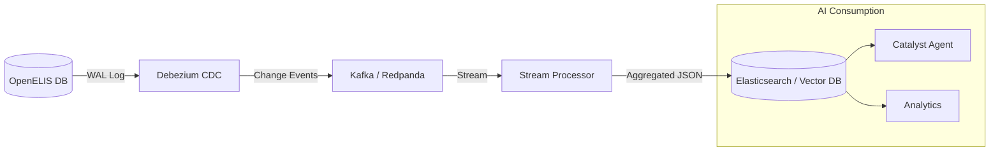

# Research: CDC → Flat Data Architecture for OpenELIS

**Feature**: OGC-070 Catalyst Assistant (Long-Term Data Layer) **Date**:
2026-01-28 **Status**: Draft / Research

## Executive Summary

This document outlines the architectural strategy for a **Change Data Capture
(CDC) to Flat JSON** data layer for OpenELIS Global. This architecture is
designed to support future AI agents (Catalyst), analytics dashboards, and
vector search features by providing a high-performance, token-efficient read
model that is decoupled from the transactional database.

**Key Decision**: We prioritize a **direct CDC → Flat JSON** pipeline over a CDC
→ FHIR → Flat pipeline. This avoids the "verbosity tax" of FHIR for internal AI
consumption while maintaining FHIR as a first-class output format for external
interoperability.

---

## 1. The Problem: Transactional vs. AI Read Models

### OpenELIS Transactional Model (Write)

The current OpenELIS database is a normalized relational model optimized for
transaction integrity (OLTP).

- **Entities**: `Sample`, `Analysis`, `Result`, `Patient`, `Organization`
- **Structure**: Highly normalized, deep hierarchy (Sample → SampleItem →
  Analysis → Result)
- **Pros**: Data integrity, efficient writes, standard SQL support
- **Cons for AI**:
  - **Complex Joins**: Answering "Give me a summary of patient X" requires
    joining 5+ tables.
  - **Token Inefficiency**: Raw entity dumps contain internal IDs, audit fields,
    and nulls that waste LLM context.
  - **Performance**: Heavy analytical queries can lock the transactional DB.

### The AI Requirement (Read)

AI agents (like Catalyst) and vector search engines need:

- **Denormalized Data**: "Sample 360" or "Patient 360" documents containing all
  relevant context.
- **Semantic Clarity**: Human-readable field names (`"status": "Completed"` vs
  `"status_id": 4`).
- **Token Efficiency**: Minimal JSON structure
  (`{"test": "Malaria", "result": "Positive"}` vs verbose FHIR wrappers).

---

## 2. Architecture Overview



### Component Stack

1.  **Source**: PostgreSQL (OpenELIS Production DB)
    - Configuration: `wal_level = logical`
2.  **Capture**: Debezium PostgreSQL Connector
    - Captures row-level changes (`INSERT`, `UPDATE`, `DELETE`)
    - Publishes to Kafka topics (e.g., `openelis.public.sample`,
      `openelis.public.analysis`)
3.  **Transport**: Kafka (or Redpanda for simpler deployment)
    - Buffers change events
    - Decouples DB from consumers
4.  **Transformation (The "Flattener")**: Custom Stream Processor
    - **Technology**: Java (Kafka Streams) or Python (Faust/Bytewax)
    - **Logic**: Joins streams (Sample + Analysis + Result) to build aggregate
      documents.
    - **Output**: "Sample 360" Flat JSON
5.  **Sink (Read Model)**: Elasticsearch / OpenSearch / Vector DB
    - Stores the flattened documents
    - Enables keyword search, vector search, and fast retrieval

---

## 3. The "Sample 360" Flat Model

Instead of raw tables, we target a document-oriented structure centered on the
**Sample** (the primary unit of work in a lab).

### Example Structure

```json
{
  "sample_id": "uuid-1234",
  "accession_number": "2026-00123",
  "collection_date": "2026-01-28T10:00:00Z",
  "status": "Finished",
  "patient": {
    "id": "pat-5678",
    "gender": "F",
    "age_years": 34
    // No PII (Name/Address) in AI Index by default
  },
  "tests": [
    {
      "name": "Malaria Smear",
      "status": "Finalized",
      "section": "Parasitology",
      "results": [
        {
          "analyte": "Parasite Count",
          "value": "1500",
          "unit": "/uL",
          "is_abnormal": true
        }
      ]
    },
    {
      "name": "Hemoglobin",
      "status": "Finalized",
      "section": "Hematology",
      "results": [
        {
          "analyte": "Hb",
          "value": "10.5",
          "unit": "g/dL",
          "ref_range": "12.0-16.0"
        }
      ]
    }
  ],
  "reflex_chain": ["Malaria Smear triggered by Fever Protocol"]
}
```

### Token Efficiency Comparison

| Format                | Structure                                    | Est. Tokens (Sample) | Suitability                |
| :-------------------- | :------------------------------------------- | :------------------- | :------------------------- |
| **Raw SQL Dump**      | Multiple rows, FK IDs                        | ~500+                | Poor (Requires joins)      |
| **FHIR Bundle**       | `DiagnosticReport` + `Observation` resources | ~800+                | Poor (Verbose boilerplate) |
| **Flat "Sample 360"** | Simplified JSON                              | ~150                 | **Excellent**              |

---

## 4. Implementation Strategy

### Phase 1: MVP (Catalyst LocalPHI Mode)

- **No CDC Infrastructure**: For the MVP, we simulate the "Read Model" using
  **MCP Tools**.
- **On-Demand Flattening**: The `get_sample_details` tool performs a SQL JOIN
  query at runtime and maps the result to the "Sample 360" JSON format _in
  memory_ before returning it to the LLM.
- **Benefit**: Validates the schema and AI utility without infrastructure
  overhead.

### Phase 2: Async Pipeline (Future)

- **Trigger**: When on-demand queries become too slow or we need cross-sample
  analytics (e.g., "Trend of Malaria cases last month").
- **Deploy Debezium**: Start streaming changes.
- **Materialize Views**: Persist the "Sample 360" documents to Elasticsearch.

---

## 5. Relationship to Google FHIR Data Pipes

Google's **FHIR Data Pipes** is a robust ETL solution for **FHIR → Analytics**
(Parquet/BigQuery).

- **When to use it**: If OpenELIS is _already_ publishing a full stream of FHIR
  resources to a FHIR Store (e.g., via the existing `DataExportService`), and we
  want to use standard tools (BigQuery, Spark) for analytics.
- **Why not for Catalyst?**:
  1.  **Latency**: Batch/ETL focus vs. real-time agent needs.
  2.  **Overhead**: Requires FHIR Store + Beam pipelines.
  3.  **Verbosity**: The intermediate FHIR step adds serialization overhead we
      don't need for internal AI.

**Verdict**: Keep FHIR Data Pipes as a "Plan B" for enterprise analytics
integration, but build the **Direct CDC → Flat** pipeline for the Catalyst AI
agent.
