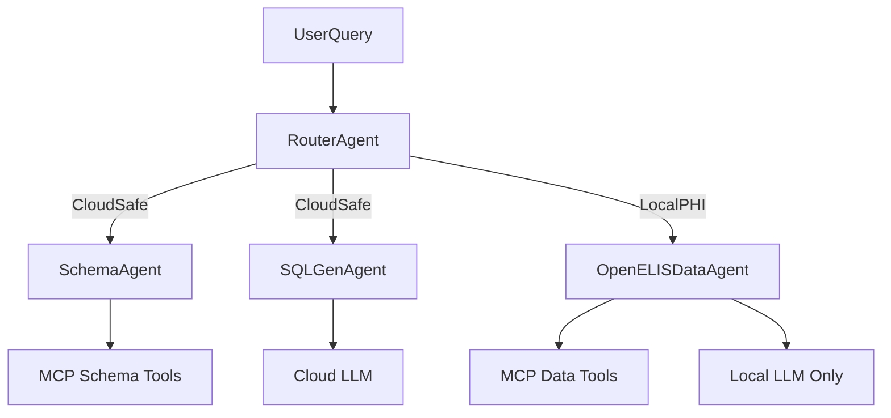

# MedGemma Methodology Alignment Plan

**Feature**: OGC-070 Catalyst LLM-Powered Lab Data Assistant  
**Plan Type**: Architecture & Methodology Research  
**Created**: 2026-01-29  
**Status**: Draft  
**Sources**: MedGemma EHR Navigator, Gemini/OpenMRS Modernization Analysis,
Community Email Thread

---

## Executive Summary

This plan documents strategic architectural decisions for evolving the OpenELIS
Catalyst project based on:

1. **MedGemma EHR Navigator** patterns (manifest→plan→fetch→filter→synthesize
   workflow)
2. **Gemini/OpenMRS modernization analysis** (FHIR verbosity tax, CDC→flat
   architecture)
3. **Community email thread consensus** (Rafał, Daniel, Burke, Ian on data layer
   architecture)

**Key Decisions**:

- Introduce **LocalPHI mode** for local-only LLM access to patient data
  (MedGemma-style workflow)
- Adopt **flat/simple JSON** for AI consumption (not raw FHIR due to 8x token
  cost)
- Use **CDC → flat** architecture for future analytics (not CDC → FHIR → flat)
- **Elevate Gemma 2 9B** to primary Orchestrator (superior RAG performance
  validated)
- Maintain **OpenELIS-native first** approach (relational model is already
  SQL-friendly)

---

## Background & Context

### Source Materials

1. **MedGemma EHR Navigator Notebook**  
   [`ehr_navigator_agent.ipynb`](https://raw.githubusercontent.com/Google-Health/medgemma/main/notebooks/ehr_navigator_agent.ipynb)  
   Google Health's reference implementation for patient data navigation using
   LLMs.

2. **Gemini/OpenMRS Modernization Report**  
   [Gemini Share](https://gemini.google.com/share/2d52e485891e)
   (November 2025)  
   Deep analysis of OpenMRS modernization including CQRS, Semantic Layer, and AI
   integration.

3. **Community Email Thread**  
   OpenMRS developer discussion on CDC pipelines, FHIR overhead, and flat data
   architectures.
   - Rafał: "raw db to flat representation is a way more natural step"
   - Daniel: "I would not even use [FHIR] at all, even as an exchange format,
     until the token cost eventually goes down"
   - Burke: "data warehouse (flattened data) + vectorized view"
   - Ian: "how do we go about deciding how to build the semantic model?"

---

## Key Insights

### 1. MedGemma EHR Navigator Workflow

The MedGemma notebook demonstrates an effective pattern for navigating large
patient records while keeping LLM context bounded:

```
UserQuery → Manifest → Identify → Plan → [Fetch → Filter]* → Synthesize
```

**Steps**:

1. **Discover/Manifest**: Call `get_patient_data_manifest` → compact "what
   exists" summary
2. **Identify relevant types**: LLM picks which resource types likely contain
   answer
3. **Plan tool calls**: LLM generates bounded list of data fetch calls up front
4. **Execute + fact-filter loop**: For each call:
   - Fetch resource slice
   - LLM extracts **only relevant facts**
   - Accumulate facts (prevents context overflow)
5. **Synthesize**: Final LLM call uses **only accumulated facts** to produce
   answer

**Why this works**: Patient records often exceed LLM context windows; iterative
fact-filtering keeps context bounded while maintaining completeness.

**Applicability to Catalyst**: This pattern maps directly to a "LocalPHI
Navigator" mode where local LLMs can access patient data through bounded MCP
tool calls.

---

### 2. The FHIR Verbosity Tax (Gemini Analysis)

**Problem**: Raw FHIR JSON is extremely verbose and costs ~8x more LLM tokens
than simple JSON.

**Concrete Example** (from Gemini transcript):

| Format               | Representation                                                                | Token Cost  |
| -------------------- | ----------------------------------------------------------------------------- | ----------- |
| **Simple JSON**      | `{"vitals": {"weight_kg": 75, "date": "2025-11-20"}}`                         | ~15 tokens  |
| **FHIR Observation** | Full resource with `resourceType`, `coding[]`, `valueQuantity`, `system` URLs | ~120 tokens |

**FHIR Observation (verbose)**:

```json
{
  "resourceType": "Observation",
  "status": "final",
  "code": {
    "coding": [
      {
        "system": "http://loinc.org",
        "code": "29463-7",
        "display": "Body Weight"
      }
    ]
  },
  "subject": { "reference": "Patient/123" },
  "valueQuantity": {
    "value": 75,
    "unit": "kg",
    "system": "http://unitsofmeasure.org",
    "code": "kg"
  },
  "effectiveDateTime": "2025-11-20"
}
```

**Gemini's Verdict**: "Do not use raw FHIR syntax to store the data for the AI.
The token overhead is too high for local models like Gemma 2."

**Recommendation**: Use "FHIR-IPS Hybrid" approach:

- Leverage FHIR logic/libraries to **generate** data (ensures clinical accuracy)
- **Strip boilerplate** before storing/sending to LLM
- Keep: `display` names, values, dates
- Drop: `system` URLs, `coding` arrays (unless critical), generic IDs

**For Catalyst LocalPHI mode**: MCP data tools MUST return **flat/semantic
JSON**, not raw FHIR resources.

---

### 3. CDC → Flat Architecture Consensus (Email Thread)

**Key Quotes**:

> **Rafał**: "raw db to flat representation is a way more natural step" vs going
> through FHIR intermediate; "Building FHIR resources for each CDC event would
> be very resource consuming"

> **Daniel**: "I would not even use [FHIR] at all, even as an exchange format,
> until the token cost eventually goes down" for AI use cases

> **Burke**: This sounds "very similar to our dream of incorporating a data
> warehouse (flattened data) into OpenMRS with the addition of a vectorized
> view"

> **Ian**: Open question — "how do we go about deciding how to build the
> semantic model? Who makes these calls?" (e.g., coordinating systolic/diastolic
> BP)

**Consensus Architecture**:

| Layer                   | Purpose                     | Format                    | Consumers              |
| ----------------------- | --------------------------- | ------------------------- | ---------------------- |
| **Transactional DB**    | Write model (OLTP)          | Normalized relational     | Clinical workflows     |
| **CDC/Event Stream**    | Change propagation          | Event log                 | ETL pipelines          |
| **Flat/Semantic Layer** | Read model for AI/analytics | Denormalized JSON/Parquet | LLMs, BI tools, ML     |
| **FHIR API**            | External interoperability   | FHIR R4                   | HIEs, external systems |

**Path Recommendation**:

- **For AI/analytics**: CDC → **flat/semantic JSON** (optimized for tokens +
  queries)
- **For external interop**: FHIR as **output/exchange format** (not internal AI
  read model)
- **Google FHIR Data Pipes**: Useful if FHIR feed exists; OpenELIS-native CDC →
  flat is more direct

**Ian's Challenge**: Deciding the flat model shape requires iterative
stakeholder collaboration (domain experts + AI engineers + clinicians).

---

### 4. OpenELIS vs OpenMRS Data Model Difference (Critical)

| Aspect                | OpenMRS                                                                                                                   | OpenELIS                                                           |
| --------------------- | ------------------------------------------------------------------------------------------------------------------------- | ------------------------------------------------------------------ |
| **Schema Type**       | EAV (Entity-Attribute-Value)                                                                                              | Traditional Relational                                             |
| **Example**           | "Blood Pressure" is `concept_id=5089` in generic `obs` table                                                              | Sample, Analysis, Result, Test entities with semantic column names |
| **SQL Generation**    | **Catastrophic** — LLMs can't reliably write queries when semantics are encoded as foreign keys                           | **Relatively friendly** — table/column names match domain concepts |
| **Gemini Assessment** | "LLMs struggle to write SQL for EAV schemas because the table structure does not semantically resemble the data it holds" | N/A — we don't have this problem                                   |

**Implication**: OpenELIS doesn't have the "EAV translation crisis" that drove
the Gemini/OpenMRS CQRS + Semantic Layer recommendations. Our existing schema
works for text-to-SQL.

**However**, the **CDC → flat/semantic layer** principle still applies for:

- **Long-term**: Analytics dashboards, pre-aggregated metrics, reporting data
  warehouse
- **Future AI features**: World models, predictive workflows, anomaly detection,
  vector search on clinical narratives

### CQRS Question: Is It Needed for OpenELIS?

**CQRS (Command Query Responsibility Segregation)** was a central recommendation
in the Gemini/OpenMRS analysis. The question is whether OpenELIS should adopt
the same pattern.

**Answer: Not immediately, but eventually for analytics/AI scale.**

| Aspect             | OpenMRS Situation                            | OpenELIS Situation                         |
| ------------------ | -------------------------------------------- | ------------------------------------------ |
| **Schema Problem** | EAV schema makes SQL generation catastrophic | Relational schema is already SQL-friendly  |
| **Immediate Need** | CQRS essential to make AI work at all        | CQRS is an optimization, not a requirement |
| **Text-to-SQL**    | Needs semantic translation layer             | Works directly against existing schema     |
| **CQRS Timing**    | Required for MVP                             | Deferred to Phase 2+ (analytics scale)     |

**Why CQRS was critical for OpenMRS**:

- "Blood Pressure" is stored as `concept_id=5089` in a generic `obs` table
- LLMs cannot reliably write SQL when semantics are encoded as foreign keys
- A "Semantic Layer" (flattened read model) is required to bridge the gap

**Why CQRS is optional for OpenELIS** (for now):

- `Sample`, `Analysis`, `Result` are explicit domain entities with semantic
  column names
- LLMs can write SQL directly against the schema (schema RAG handles table
  selection)
- The CloudSafe text-to-SQL workflow works without a separate read model

**When OpenELIS should adopt CQRS**:

1. **Analytics at scale**: When reporting queries compete with clinical
   workflows for DB resources
2. **Cross-entity search**: "Find all samples with similar patterns to X"
   (vector search)
3. **Predictive AI**: World models or anomaly detection requiring denormalized
   feature sets
4. **LocalPHI mode at scale**: When on-demand flattening (MCP tools) becomes too
   slow

**Architecture for eventual CQRS** (see `artifacts/cdc-flat-architecture.md`):

```
Write Path (unchanged):
  UI → Service → DAO → PostgreSQL (transactional)

Read Path (new, future):
  PostgreSQL → CDC → Flattener → Elasticsearch/VectorDB → AI/Analytics
```

**MVP Strategy**: For LocalPHI mode, we simulate the read model using
**on-demand flattening** in MCP tools. The `get_sample_details` tool performs
JOINs at runtime and maps to "Sample 360" JSON format in memory. This validates
the schema without infrastructure overhead.

---

### 5. Gemma 2 Model Validation (Healthcare RAG)

**From Gemini Transcript** (validates Catalyst `research.md` Section 13):

| Model                 | Use Case            | Hardware    | Gemini's Rationale                                                                                                 |
| --------------------- | ------------------- | ----------- | ------------------------------------------------------------------------------------------------------------------ |
| **Gemma 2 9B**        | Server/Orchestrator | 12-16GB RAM | "Often outperforms Llama 3 (8B) in complex reasoning benchmarks"; "famously good at reading comprehension" for RAG |
| **Gemma 2 2B**        | Edge/tablet         | ~2GB RAM    | "Killer feature for OpenMRS" — enables AI on low-power hardware; Llama 3 has no viable 2B                          |
| **MedGemma/BioGemma** | Healthcare-specific | Variable    | Fine-tuned on PubMed/clinical literature; "Best out-of-the-box for terminology"                                    |

**Current Catalyst Position**: Llama 3.1 8B (default) + Gemma 2 9B (fallback)
for Tier A Orchestrator.

**Recommendation**: **Elevate Gemma 2 9B to primary** Orchestrator choice (swap
with Llama 3.1 8B).

**Rationale**: Gemini explicitly states Gemma 2 9B's "reading comprehension"
superiority is ideal for RAG workflows like Catalyst.

---

## Proposed Architecture

### Two Safety Modes

#### Mode 1: CloudSafe SQL Assistant (Existing Catalyst Intent)

- **LLM context**: Schema metadata only (table/column names, types,
  relationships)
- **Providers**: Gemini (cloud) allowed
- **Primary workflow**: NL → schema retrieval (MCP) → SQL generation → validate
  → user review → backend executes
- **Privacy guarantee**: Zero PHI/row data sent to LLM

#### Mode 2: LocalPHI OpenELIS Navigator (New — MedGemma Pattern)

- **LLM context**: May include row/patient data **only via MCP tools**, with
  strict scoping
- **Providers**: Local/on-prem only (LM Studio, Ollama) — hard block on cloud
  providers
- **Primary workflow** (MedGemma-style):
  1. **Manifest**: `get_sample_manifest(accession)` → compact summary
  2. **Plan**: LLM generates bounded list of tool calls
  3. **Execute + fact-filter**: For each call, LLM extracts only relevant facts
  4. **Synthesize**: Final answer uses accumulated facts only

**Privacy boundary**: Tools return **flat/simple JSON** (never FHIR), with
strict row caps.



### Guardrails for LocalPHI Mode

- **Hard provider enforcement**: Patient/row data tools blocked unless provider
  is local/on-prem
- **Audit hygiene**: Logs capture metadata (tools, tables) but **never store
  patient values**
- **RBAC**: LocalPHI mode requires explicit roles + feature flag (never
  accidentally enabled)
- **Flat JSON mandate**: Data tools return simplified JSON (not raw FHIR) to
  minimize token cost

---

## MedGemma → OpenELIS Mapping

| MedGemma Concept          | OpenELIS Equivalent                            | Catalyst Implementation                                     |
| ------------------------- | ---------------------------------------------- | ----------------------------------------------------------- |
| **FHIR resource types**   | **Domain entities** (Sample, Analysis, Result) | MCP tool categories                                         |
| **Patient data manifest** | **Sample/patient context manifest**            | `get_sample_manifest`, `get_patient_test_summary` MCP tools |
| **Tool planning**         | **MCP call planning**                          | LLM generates JSON list of bounded tool calls               |
| **Fact filtering**        | **Row-level fact extraction**                  | LLM extracts relevant facts after each MCP tool invocation  |
| **Final synthesis**       | **Answer generation**                          | LLM uses accumulated facts (not raw data)                   |

### Proposed MCP Data Tools (LocalPHI Mode)

| Tool                                | Description              | Output Format                               |
| ----------------------------------- | ------------------------ | ------------------------------------------- |
| `get_sample_manifest(patient_id)`   | List of Sample summaries | `[{accession, date, status, test_count}]`   |
| `get_sample_details(accession)`     | Sample + Analysis list   | `{sample_info, analyses: [{test, status}]}` |
| `get_results_for_sample(accession)` | Result values            | `[{test, analyte, value, unit, ref_range}]` |
| `get_analysis_timeline(accession)`  | Workflow trace           | `[{timestamp, action, actor}]`              |

---

## Implementation Roadmap

### Phase 1: Immediate (M0.2 Completion)

1. **Tighten schema context plumbing**: Pass structured JSON from SchemaAgent →
   SQLGenAgent
2. **Unify provider handling**: SQLGen uses provider abstraction (Gemini + LM
   Studio)
3. **Validate existing flow**: M0.2 tests prove multi-agent delegation works

### Phase 2: LocalPHI Mode (Post-M0.2, Parallel with M1/M2)

4. **Add LocalPHI agent**: `OpenELISDataAgent` implementing
   manifest→plan→fetch→filter→synthesize
5. **Add MCP data tools**: Local-only tools with row caps and flat JSON output
6. **Router mode selection**: Route CloudSafe vs LocalPHI based on query
   intent + provider
7. **Provider enforcement**: Block patient-data tools if provider is cloud
8. **Safety tests**: Trajectory tests proving cloud never sees PHI

### Phase 3: Documentation Updates

9. **Spec/plan amendments**: Define two modes, provider enforcement, audit rules
10. **research.md update**: Gemma 2 9B → primary Orchestrator (Section 13)
11. **CDC/flat architecture doc**: Long-term data layer strategy (see
    `artifacts/cdc-flat-architecture.md`)

### Future Phases

| Phase                       | Scope                                                | Trigger                                    |
| --------------------------- | ---------------------------------------------------- | ------------------------------------------ |
| **CDC → Flat Data Layer**   | Debezium/Hibernate Listeners → Elasticsearch/Parquet | Analytics dashboards, vector search needed |
| **FHIR Expert Agent**       | Separate agent for FHIR-specific queries             | FHIR interoperability use cases            |
| **Tier B Model Evaluation** | Gemma 2 9B / CodeLlama 34B on 40GB+ hardware         | Server-class GPU available                 |

---

## Success Criteria

- [ ] **CloudSafe path** continues to work and remains PHI-safe (schema-only)
- [ ] **LocalPHI path** can answer OpenELIS-native questions without sending PHI
      to cloud
- [ ] **Safety tests prove**:
  - PHI-like query + cloud provider → router blocks
  - Patient-data tool invoked + cloud provider → execution blocked
  - Audit logs contain metadata only (no patient values)
- [ ] **Model evaluation** shows Gemma 2 9B ≥ Llama 3.1 8B for Catalyst RAG
      tasks

---

## Open Questions

1. **Flat model shape**: How do we coordinate related observations (e.g.,
   systolic/diastolic BP) in flat JSON? (Ian's question)
2. **LocalPHI rollout strategy**: Feature flag + RBAC vs. deployment-time
   configuration?
3. **Audit requirements**: What metadata is sufficient for compliance without
   storing PHI?
4. **Edge deployment**: When do we need Gemma 2 2B for tablet/offline scenarios?

---

## References

### Internal

- [Catalyst Spec](../spec.md)
- [Catalyst Implementation Plan](../plan.md)
- [Catalyst Research](../research.md)
- [CDC/Flat Architecture](../artifacts/cdc-flat-architecture.md)
- [Lightweight Data Strategy](../artifacts/lightweight-data-strategy.md)
- [World Model Research](../artifacts/world-model-research.md)

### External

- [MedGemma EHR Navigator Notebook](https://raw.githubusercontent.com/Google-Health/medgemma/main/notebooks/ehr_navigator_agent.ipynb)
- [Google FHIR Data Pipes](https://developers.google.com/open-health-stack/fhir-analytics/data-pipes)
- [A2A Protocol](https://google.github.io/A2A/)
- [MCP Documentation](https://modelcontextprotocol.io/)

---

**Last Updated**: 2026-01-29  
**Author**: Catalyst Development Team
